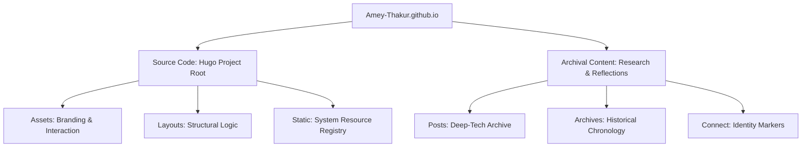

  
  #  Amey's Arc

  
  
  
  

   

  *Scholarly digital identity and technical architectural archives.*

  **[Source Code](Source%20Code/)** &nbsp;·&nbsp; **[Archival Content](content/)** &nbsp;·&nbsp; **[Live Site](https://amey-thakur.github.io/)**

---

  [Author](#author) &nbsp;·&nbsp; [Overview](#overview) &nbsp;·&nbsp; [Project Structure](#project-structure) &nbsp;·&nbsp; [Dual-Licensing](#dual-licensing-model) &nbsp;·&nbsp; [Tech Stack](#tech-stack)

---

<!-- AUTHOR -->

  
  ## Author

|  [**Amey Thakur**](https://github.com/Amey-Thakur)   |
| :---: |

---

<!-- OVERVIEW -->

## Overview

**Amey's Arc** is a sovereign digital archive and technical identity hub. It serves as an authoritative repository for technical notes, research reflections, and architectural insights, meticulously documented to maintain scholarly rigor and engineering clarity. Developed using a decoupled Hugo architecture, the platform preserves the intellectual evolution of complex software engineering and research exploration.

> [!NOTE]
> ###  Architectural Engine: Amey's Arc
> This repository utilizes a custom-configured **Hugo** engine with split configuration manifests (**Site.toml** and **Engine.toml**). The architecture separates functional infrastructure (Source Code) from archival prose (Content), ensuring modularity and long-term data integrity.

---

<!-- STRUCTURE -->

## Project Structure

### Repository Topology

├── **[Source Code/](Source%20Code/)**           # Integrated Hugo application layer
│   ├── **[assets/](Source%20Code/assets/)**          # Global system resources & CSS Foundations
│   ├── **[layouts/](Source%20Code/layouts/)**         # Modular templates & scholarly partials
│   ├── **[static/](Source%20Code/static/)**          # Static assets & PWA identifiers
│   ├── **Site.toml**                   # Global environmental manifest
│   └── **Engine.toml**                 # Technical theme specifications
│
├── **[content/](content/)**               # Scholarly content & intellectual archives
│   ├── **[posts/](content/posts/)**             # Deep-tech & research publications
│   └── **[archives/](content/archives/)**          # Historical navigation indices
│
└── **README.md**                       # Primary architectural entrance

---

<!-- LICENSING -->

## Dual-Licensing Protocol

This repository operates under a **dual-licensing framework** to distinguish between creative intellectual property and technical engineering logic.

### 🖋️ Content & Intellect
All original prose, research posts, and technical reflections are licensed under the **[Creative Commons Attribution 4.0 International (CC BY 4.0)](LICENSE)**.
- **Academic Standard**: Citation and attribution are required for reproduction.
- **Scope**: Files within the **`content/`** directory.

### ⚙️ Infrastructure & Logic
All functional components, including Hugo templates, custom CSS/JS, and automation logic, are licensed under the **[MIT License](Source%20Code/LICENSE)**.
- **Engineering Standard**: Permissive reuse for infrastructure and toolchains.
- **Scope**: Files within the **`Source Code/`** directory.

---

### Tech Stack
- **Engine**: **Hugo 0.146.0+**
- **Markdown**: **Goldmark Rendering Framework**
- **Logic**: **Vanilla CSS / ES6 Modules**
- **Metadata**: **TOML Configuration Schema**
- **Deployment**: **GitHub Pages**

---

  [↑ Back to Top](#readme-top)

   **[Amey's Arc](https://amey-thakur.github.io/)**

