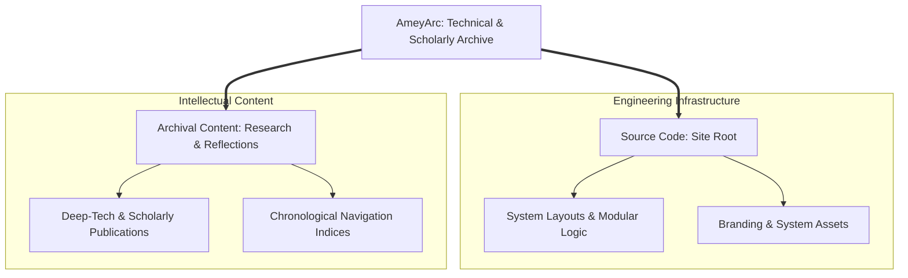

<div align="center">

<a href="https://amey-thakur.github.io/" title="Open Amey's Arc"></a>

# Amey's Arc

[](LICENSE)

[](https://github.com/Amey-Thakur/Amey-Thakur.github.io/actions)
[](https://github.com/Amey-Thakur)

  **Advancing ideas @ AmeyArc_**

  Namaskar, I’m Amey. This is my space for notes, reflections, and ideas in progress. Some thoughts are fully formed, others are just sparks, but all are here to explore, share, and grow. I hope these notes spark your thinking, and this space grows with every reflection, including yours.

**[Source Code](Source%20Code/)** &nbsp;·&nbsp; **[Archival Content](content/)** &nbsp;·&nbsp; **[Amey's Arc](https://amey-thakur.github.io/)**

</div>

---

<div align="center">

[Author](#author) &nbsp;·&nbsp; [Overview](#overview) &nbsp;·&nbsp; [Repository Structure](#repository-structure) &nbsp;·&nbsp; [Dual-Licensing](#dual-licensing-model) &nbsp;·&nbsp; [Tech Stack](#tech-stack) &nbsp;·&nbsp; [Usage Guidelines](#usage-guidelines) &nbsp;·&nbsp; [About](#about-this-repository)

</div>

---

<a name="author"></a>
<div align="center">

## Author

| <a href="https://github.com/Amey-Thakur"></a><br>[**Amey Thakur**](https://github.com/Amey-Thakur)<br><br>[](https://orcid.org/0000-0001-5644-1575) |
| :---: |

</div>

---

<a name="overview"></a>
## Overview

**Amey's Arc** is a written record of research and engineering work, published while it is in progress rather than assembled afterwards. The subject matter follows the work rather than a fixed syllabus. This repository holds the site that publishes it: the content, the theme that renders it, and the pipeline that deploys it.

> [!TIP]
> The point of keeping it in the open is the record over time: what a line of
> work looked like early on is usually more useful than the account written
> once the answer is known.

### What is here

Entries are organised by what they are, not by which field they belong to. A
reader arriving from a search result will find one of these:

| Kind of entry | What it contains |
| :--- | :--- |
| **Derivation** | Mathematics carried through step by step, with the algebra shown rather than cited |
| **Paper reading** | A close reading of a published work: what it claims, how it argues it, and where the argument is load-bearing |
| **Project record** | What was built, the decisions taken, and the constraints that forced them |
| **Method note** | A technique written down properly the first time it is used, so it need not be rederived |
| **Negative result** | Work that did not behave as expected, kept because the reason is the useful part |

The subject matter follows the work rather than a syllabus. It has so far
covered learning systems and the statistics under them, distributed and
embedded engineering, graphics and geometry, and applied numerical work, and
that list is a description of what exists rather than a boundary on what will.

---

<a name="repository-structure"></a>
## Repository Structure



### Repository Topology

```python
Amey-Thakur.github.io/
│
├── Source Code/                        # The site: templates, styling, and behaviour
│   ├── assets/                         # Global system resources & CSS Foundations
│   ├── layouts/                        # Modular templates & scholarly partials
│   ├── static/                         # Static assets & PWA identifiers
│   ├── Site.toml                       # Global environmental manifest
│   ├── Engine.toml                     # Technical theme specifications
│   └── LICENSE                         # Infrastructure logic license (MIT)
│
├── content/                            # Scholarly content & intellectual archives
│   ├── posts/                          # Deep-tech & research publications
│   └── archives/                       # Historical navigation indices
│
├── LICENSE                             # Archival content license (CC BY 4.0)
└── README.md                           # Primary architectural entrance
```

---

<a name="dual-licensing-model"></a>
## Dual-Licensing Protocol

This repository operates under a dual-licensing framework to distinguish between creative intellectual property and technical engineering logic.

> [!NOTE]
> ### Open Research and Engineering Framework
> This repository operates under a dual-licensing protocol to ensure appropriate scholarly attribution while supporting permissive engineering reuse:
> 
> 1. **Archival Content**: All original prose, research posts, and technical reflections (located within the `content/` directory) are licensed under the **[Creative Commons Attribution 4.0 International (CC BY 4.0)](LICENSE)**.
> 2. **Technical Logic**: All functional components, including the templates, custom CSS and JavaScript, and automation logic (located within the `Source Code/` directory) are licensed under the **[MIT License](Source%20Code/LICENSE)**.

---

<a name="tech-stack"></a>
## Tech Stack

| Core Component | Implementation Methodology |
| :--- | :--- |
| **Output** | Static site, built and deployed automatically |
| **Logic Framework** | **Goldmark Rendering Framework** |
| **Interactive Shell** | **Vanilla CSS / ES6 Modules** |
| **Metadata Schema** | **TOML Configuration Hierarchies** |
| **Deployment Hub** | **GitHub Pages** |

---

<a name="usage-guidelines"></a>
## Usage Guidelines

This repository is openly shared to support scholarly communication and engineering research across the global community.

**For Researchers**  
Use this project to reference **scholarly technical notes**, **research reflections**, and **architectural insights**. This archive is meticulously maintained to preserve the intellectual evolution of complex software engineering and research exploration for authoritative academic study.

**For Developers**  
Use this repository as reference material for understanding **a site split into its templates and its content**, **configuration split across TOML files**, and **a static site that owns its own deployment** within large-scale static site synthesis.

**For Educators**  
These resources and their underlying architectural documentation may serve as a teaching utility for **Professional Engineering Documentation**, **Archival Architecture**, and **Project Lifecycle Management**. Attribution is appreciated when utilizing these resources.

---

<a name="about-this-repository"></a>
## About This Repository

**Created and Maintained by**: [Amey Thakur](https://github.com/Amey-Thakur)

Amey's Arc is a curated digital space for technical notes, research reflections, and architectural insights. It serves as an evolving record of engineering thought and scholarly exploration.

**Connect:** [GitHub](https://github.com/Amey-Thakur) &nbsp;·&nbsp; [LinkedIn](https://www.linkedin.com/in/amey-thakur) &nbsp;·&nbsp; [ORCID](https://orcid.org/0000-0001-5644-1575)

---

<div align="center">

  [↑ Back to Top](#ameys-arc)

  [Author](#author) &nbsp;·&nbsp; [Overview](#overview) &nbsp;·&nbsp; [Repository Structure](#repository-structure) &nbsp;·&nbsp; [Dual-Licensing](#dual-licensing-model) &nbsp;·&nbsp; [Tech Stack](#tech-stack) &nbsp;·&nbsp; [Usage Guidelines](#usage-guidelines) &nbsp;·&nbsp; [About](#about-this-repository)

  <br>

  <a href="https://amey-thakur.github.io/"></a> **[Amey's Arc](https://amey-thakur.github.io/)**

</div>

