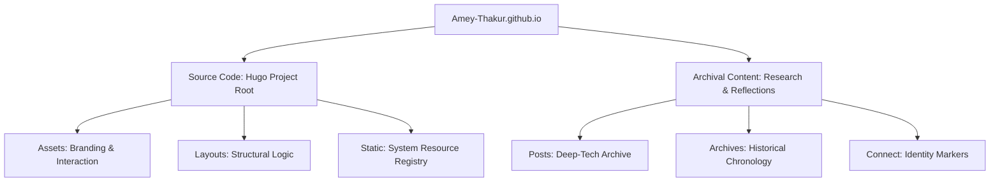

#  Amey's Arc

  **Advancing ideas @ AmeyArc_**

  Hi, I’m Amey. This is my space for notes, reflections, and ideas in progress. Some thoughts are fully formed, others are just sparks, but all are here to explore, share, and grow. I hope these notes spark your thinking, and this space grows with every reflection, including yours.

**[Source Code](Source%20Code/)** &nbsp;·&nbsp; **[Archival Content](content/)** &nbsp;·&nbsp; **[Live Site](https://amey-thakur.github.io/)**

---

[Author](#author) &nbsp;·&nbsp; [Overview](#overview) &nbsp;·&nbsp; [Project Structure](#project-structure) &nbsp;·&nbsp; [Dual-Licensing](#dual-licensing-model) &nbsp;·&nbsp; [Tech Stack](#tech-stack)

---

## Author

|  [**Amey Thakur**](https://github.com/Amey-Thakur)   |
| :---: |

---

## Overview

**Amey's Arc** is a curated digital archive of research work, technical projects, and evolving ideas. It serves as a standardized platform for documenting engineering reflections and scholarly exploration across diverse domains, including Artificial Intelligence, Distributed Systems, and Control Engineering. The repository provides the underlying documentation for the methodologies and insights presented on the live scholarly portal.

### Technical Archetypes
The archive preserves granular documentation for various research vectors:
- **Artificial Intelligence**: Exploration of Zero-Shot Video Generation, Generative Adversarial Networks (GANs), and Reinforcement Learning strategies.
- **Embedded Systems & Control**: Adaptive Cruise Control architectures using Arduino and Simulink environments.
- **Distributed Architectures**: Technical analysis of distributed file systems and clock synchronization protocols.
- **Computational Geometry**: Development of high-performance spatial partitioning through Quadtree visualizations.

---

## Project Structure

### Repository Topology

├── **[Source Code/](Source%20Code/)**           # Integrated Hugo application layer
│   ├── **[assets/](Source%20Code/assets/)**          # Global system resources & CSS Foundations
│   ├── **[layouts/](Source%20Code/layouts/)**         # Modular templates & scholarly partials
│   ├── **[static/](Source%20Code/static/)**          # Static assets & PWA identifiers
│   ├── **Site.toml**                   # Global environmental manifest
│   └── **Engine.toml**                 # Technical theme specifications
│
├── **[content/](content/)**               # Scholarly content & intellectual archives
│   ├── **[posts/](content/posts/)**             # Deep-tech & research publications
│   └── **[archives/](content/archives/)**          # Historical navigation indices
│
└── **README.md**                       # Primary architectural entrance

---

## Dual-Licensing Protocol

This repository operates under a **dual-licensing framework** to distinguish between creative intellectual property and technical engineering logic.

### 🖋️ Content & Intellect
All original prose, research posts, and technical reflections are licensed under the **[Creative Commons Attribution 4.0 International (CC BY 4.0)](LICENSE)**.
- **Academic Standard**: Citation and attribution are required for reproduction.
- **Scope**: Files within the **`content/`** directory.

### ⚙️ Infrastructure & Logic
All functional components, including Hugo templates, custom CSS/JS, and automation logic, are licensed under the **[MIT License](Source%20Code/LICENSE)**.
- **Engineering Standard**: Permissive reuse for infrastructure and toolchains.
- **Scope**: Files within the **`Source Code/`** directory.

---

### Tech Stack
- **Engine**: **Hugo 0.146.0+**
- **Markdown**: **Goldmark Rendering Framework**
- **Logic**: **Vanilla CSS / ES6 Modules**
- **Metadata**: **TOML Configuration Schema**
- **Deployment**: **GitHub Pages**

---

[↑ Back to Top](#readme-top)

 **[Amey's Arc](https://amey-thakur.github.io/)**

