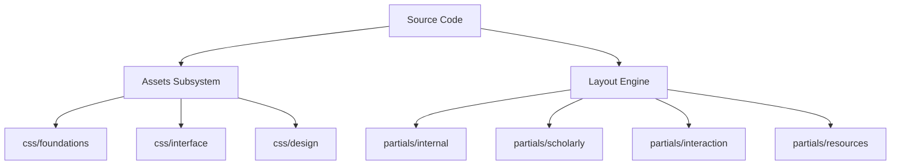

# Architectural Specification: Amey's Arc Infrastructure

This document serves as the formal technical manifest for the site's codebase. It outlines the modular hierarchy, directory logic, and functional purpose of each component within the `Source Code` directory.

---

## Technical Hierarchy Visualization

---

## 1. Asset Subsystem (`/assets`)
Management of design tokens, structural aesthetics, and interactive logic.

| Category | File Path | Functional Description |
| :--- | :--- | :--- |
| **Foundations** | [`css/foundations/Variables.css`](./assets/css/foundations/Variables.css) | Global design tokens: HSL color scales, typography metrics, and spacing. |
| | [`css/foundations/Reset.css`](./assets/css/foundations/Reset.css) | Browser normalization and foundational reset rules. |
| | [`css/foundations/System_Display.css`](./assets/css/foundations/System_Display.css) | Visual system logic including scrollbar aesthetics. |
| **Interface** | [`css/interface/Global_Layout.css`](./assets/css/interface/Global_Layout.css) | Core site skeleton: Layout containers, responsive grid, and spacing. |
| | [`css/interface/Article_Detailed.css`](./assets/css/interface/Article_Detailed.css) | Refined typography and spacing for the primary reading experience. |
| | [`css/interface/Navigation_UI.css`](./assets/css/interface/Navigation_UI.css) | Interface logic for headers, menus, and navigation toggles. |
| **Design** | [`css/design/Signature_Visuals.css`](./assets/css/design/Signature_Visuals.css) | Bespoke interaction logic: Particle systems and "Thought Balloon" effects. |
| | [`css/design/Syntax_Colorway.css`](./assets/css/design/Syntax_Colorway.css) | Academic code syntax highlighting (Chroma implementation). |

---

## 2. Layout Engine (`/layouts`)
The structural blueprint governing content-to-HTML translation.

### Internal Operations (Core Infrastructure)
| Component | Purpose |
| :--- | :--- |
| [`partials/internal/Site_Head.html`](./layouts/partials/internal/Site_Head.html) | Technical initialization: Meta-tags, Resource bundling, and Scripts. |
| [`partials/internal/Primary_Navigation.html`](./layouts/partials/internal/Primary_Navigation.html) | Global Header architecture and accessibility logic. |
| [`partials/internal/SEO_OpenGraph.html`](./layouts/partials/internal/SEO_OpenGraph.html) | Semantic manifest for social and search discovery. |

### Scholarly Layer (Academic Features)
| Component | Purpose |
| :--- | :--- |
| [`partials/scholarly/Abstract_Outline.html`](./layouts/partials/scholarly/Abstract_Outline.html) | Hierarchical Table of Contents (TOC) generator. |
| [`partials/scholarly/Reading_Metrics.html`](./layouts/partials/scholarly/Reading_Metrics.html) | Academic metadata: Timestamps, reading duration, and word counts. |
| [`partials/scholarly/Citation_Trail.html`](./layouts/partials/scholarly/Citation_Trail.html) | Contextual navigation (Breadcrumbs) for site hierarchy. |

### Resource Management
| Component | Purpose |
| :--- | :--- |
| [`partials/resources/Vector_Icon_Library.html`](./layouts/partials/resources/Vector_Icon_Library.html) | Centralized SVG library for high-fidelity interface icons. |
| [`partials/resources/Media_Processor.html`](./layouts/partials/resources/Media_Processor.html) | Algorithmic logic for automated image resizing and distribution. |

---

## 3. Modular Augmentations (`/shortcodes`)
Reusable scholarly components for content enhancement.

- [`Expandable_Section.html`](./layouts/shortcodes/Expandable_Section.html): Logic for collapsible technical appendices.
- [`Professional_Grid.html`](./layouts/shortcodes/Professional_Grid.html): Structured visual layout for academic and professional networking.

---

## Operational Workflow Reference
- **Theme/Brand Adjustments**: Modify `css/foundations/Variables.css`.
- **Structural Integrity**: Update `layouts/_default/baseof.html` and its `Internal/` partials.
- **Academic Feature Updates**: Focus on the `Scholarly/` modules within the partials directory.
