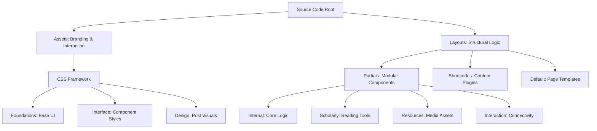

# Architectural Guide: Amey's Arc

This document serves as the authoritative map for the standardized architecture of **Amey's Arc**. The codebase is organized into a layered hierarchy designed for scalability, performance, and scholarly rigor.

## System Visualization

## I. Assets Hierarchy

Stylesheets are partitioned into functional tiers to maintain a strict separation of concerns.

### Foundations
The base layer defining design tokens and global resets.

| Path | Primary Function |
| :--- | :--- |
| [Variables.css](./assets/css/foundations/Variables.css) | Design tokens, color palettes, and global variables. |
| [Reset.css](./assets/css/foundations/Reset.css) | Cross-browser CSS normalization. |
| [Responsive.css](./assets/css/foundations/Responsive.css) | Global media query breakpoints. |
| [System_Display.css](./assets/css/foundations/System_Display.css) | Technical UI markers and scrollbar styling. |

### Interface
Structural styling for visual components and site layout.

| Path | Primary Function |
| :--- | :--- |
| [Global_Layout.css](./assets/css/interface/Global_Layout.css) | Primary grid system and section spacing. |
| [Navigation_UI.css](./assets/css/interface/Navigation_UI.css) | Aesthetic logic for the header and menus. |
| [Article_Detailed.css](./assets/css/interface/Article_Detailed.css) | Post-single typography and prose layout. |
| [Article_Preview.css](./assets/css/interface/Article_Preview.css) | Visual styling for home cards and list items. |
| [Archive_UI.css](./assets/css/interface/Archive_UI.css) | UI layout for archival navigation. |
| [Search_UI.css](./assets/css/interface/Search_UI.css) | Real-time search result styling. |
| [Taxonomy_UI.css](./assets/css/interface/Taxonomy_UI.css) | Tag cloud and category listing aesthetics. |
| [Footer_UI.css](./assets/css/interface/Footer_UI.css) | Structural design for the site footer. |

### Design
Specialized visual effects and bespoke animations.

| Path | Primary Function |
| :--- | :--- |
| [Signature_Visuals.css](./assets/css/design/Signature_Visuals.css) | Animations, signature particles, and bloom effects. |
| [Syntax_Base.css](./assets/css/design/Syntax_Base.css) | Fundamental code block rendering rules. |
| [Syntax_Colorway.css](./assets/css/design/Syntax_Colorway.css) | Chroma syntax highlighting themes. |

---

## II. Layout Components

TEMPLATES are modularized into "partials" for maintainability and "shortcodes" for content flexibility.

### internal
Core technical logic and SEO infrastructure.

| Path | Primary Function |
| :--- | :--- |
| [Site_Head.html](./layouts/partials/internal/Site_Head.html) | Metadata, asset pipeline, and header injection. |
| [Primary_Navigation.html](./layouts/partials/internal/Primary_Navigation.html) | Site menu logic and branding injection. |
| [Primary_Footer.html](./layouts/partials/internal/Primary_Footer.html) | Technical implementation of footer data. |
| [SEO_OpenGraph.html](./layouts/partials/internal/SEO_OpenGraph.html) | OpenGraph protocol for social sharing. |
| [SEO_Schema_JSON.html](./layouts/partials/internal/SEO_Schema_JSON.html) | Structured data for scholarly indexing. |

### scholarly
Enhanced reading and navigational tools.

| Path | Primary Function |
| :--- | :--- |
| [Abstract_Outline.html](./layouts/partials/scholarly/Abstract_Outline.html) | Interactive Table of Contents. |
| [Reading_Metrics.html](./layouts/partials/scholarly/Reading_Metrics.html) | Date formatting and reading time calculations. |
| [Scholar_Identity.html](./layouts/partials/scholarly/Scholar_Identity.html) | Dynamic author profile and professional bio. |
| [Citation_Trail.html](./layouts/partials/scholarly/Citation_Trail.html) | Breadcrumb navigation logic. |

### resources
Asset management and vector handling.

| Path | Primary Function |
| :--- | :--- |
| [Vector_Icon_Library.html](./layouts/partials/resources/Vector_Icon_Library.html) | Central repository for site SVGs. |
| [Cover_Imagery.html](./layouts/partials/resources/Cover_Imagery.html) | Logic for featured image processing. |
| [Media_Processor.html](./layouts/partials/resources/Media_Processor.html) | Lazy-loading and responsive image logic. |

### interaction
Connectivity and social synthesis.

| Path | Primary Function |
| :--- | :--- |
| [Connection_Links.html](./layouts/partials/interaction/Connection_Links.html) | Social network link generation. |
| [Knowledge_Sharing.html](./layouts/partials/interaction/Knowledge_Sharing.html) | Social sharing buttons for dissemination. |

---

## III. Content Tools

### Shortcodes
Markdown plugins for advanced content visualization.

| Path | Primary Function |
| :--- | :--- |
| [Professional_Grid.html](./layouts/shortcodes/Professional_Grid.html) | Responsive scholarly connectivity grid. |
| [Academic_Figure.html](./layouts/shortcodes/Academic_Figure.html) | Semantic figure/caption containers. |
| [Expandable_Section.html](./layouts/shortcodes/Expandable_Section.html) | Collapsible content blocks for technical detours. |

---

## IV. Global Configuration

| Path | Primary Function |
| :--- | :--- |
| [hugo.toml](./hugo.toml) | The master configuration manifest. |
| [theme.toml](./theme.toml) | Theme technical specifications. |
| [README.md](./README.md) | High-level development overview. |

---
*Verified for Scholarly Integrity: 2026-02-22*
