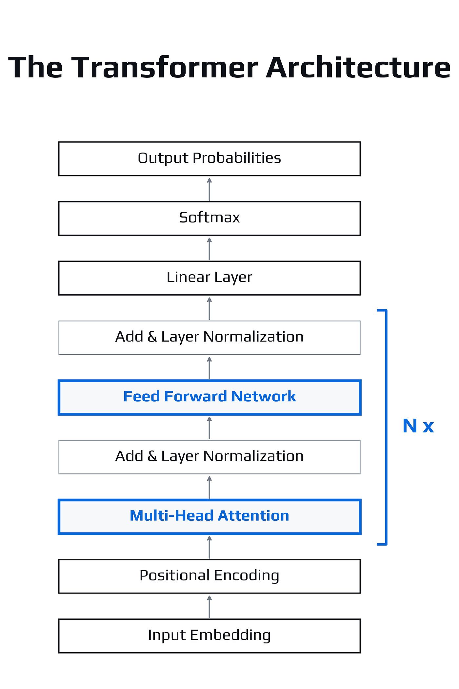

A visual cover introducing the mathematical foundations of the Transformer architecture from the paper Attention Is All You Need. The graphic highlights the core scaled dot-product attention equation alongside the key components of the architecture: self-attention, multi-head attention, and positional encoding.



*Architecture of the Transformer model introduced in* Attention Is All You Need *(Vaswani et al., 2017). The model processes input embeddings with positional encodings through stacked layers of multi-head self-attention and feed-forward networks, followed by a linear projection and Softmax to produce output probabilities.*

## Introduction

In 2017, researchers at Google introduced the paper *Attention Is All You Need* by [Ashish Vaswani](https://scholar.google.com/citations?user=oR9sCGYAAAAJ&hl=en) and colleagues. The paper proposed a new neural architecture for sequence modelling known as the **Transformer**.

Earlier neural architectures for language processing relied primarily on recurrence or convolution. The Transformer instead introduced a mechanism called **self-attention**, which allows every token in a sequence to interact directly with every other token.

This architectural change significantly improved the efficiency and scalability of neural language models. According to [Google Scholar (2026)](https://scholar.google.com/citations?view_op=view_citation&hl=en&user=oR9sCGYAAAAJ&citation_for_view=oR9sCGYAAAAJ%3AzYLM7Y9cAGgC), the paper has accumulated **over 240,000 citations**, making it one of the most influential works in modern machine learning.

The goal of this article is to explain the **mathematical foundations of the Transformer architecture** in a clear and accessible way.

## Overview

I originally summarized the central idea of the paper in the following X thread.

<blockquote class="twitter-tweet"><p lang="en" dir="ltr">1/8<br><br>A paper that shaped modern natural language processing.<br><br>"Attention Is All You Need" (Vaswani et al., 2017)<br><br>It introduced the Transformer architecture used by many modern language models.<br><br>A short explanation of the central idea.</p>&mdash; Amey Thakur (@iameythakur) <a href="https://x.com/iameythakur/status/2033045678423683185?ref_src=twsrc%5Etfw">March 15, 2026</a></blockquote> <script async src="https://platform.x.com/widgets.js" charset="utf-8"></script>

The thread provides a concise overview of the paper.
The following sections expand on the **mathematical structure of the Transformer architecture**.

## Sequence Modelling Before Transformers

Before the introduction of the Transformer architecture, most neural language models relied on **recurrent neural networks (RNNs)** or **long short-term memory networks (LSTMs)**.

In these architectures, a sequence of tokens <i>x</i><sub>1</sub>, <i>x</i><sub>2</sub>, <i>x</i><sub>3</sub>, ..., <i>x</i><sub><i>n</i></sub> is processed sequentially.

At each step, the model computes a hidden representation

<i>h</i><sub><i>t</i></sub> = <i>f</i>(<i>x</i><sub><i>t</i></sub>, <i>h</i><sub><i>t</i>−1</sub>)

where

* <i>x</i><sub><i>t</i></sub> represents the current token
* <i>h</i><sub><i>t</i>−1</sub> represents the hidden state from the previous step

This formulation introduces two important limitations.

First, sequential computation prevents efficient parallelization during training.

Second, modelling **long-range dependencies** becomes difficult because information must propagate through many intermediate steps.

The Transformer architecture addresses these limitations by allowing **direct interactions between all tokens in the sequence**.

## Self-Attention

Self-attention enables each token in a sentence to determine which other tokens are most relevant when constructing its representation.

Consider a sequence of token embeddings:

<i>x</i><sub>1</sub>, <i>x</i><sub>2</sub>, ..., <i>x</i><sub><i>n</i></sub>

Each token embedding is transformed into three vectors using learned linear projections:

<i>q</i><sub><i>i</i></sub> = <i>x</i><sub><i>i</i></sub><i>W</i><sup><i>Q</i></sup>

<i>k</i><sub><i>i</i></sub> = <i>x</i><sub><i>i</i></sub><i>W</i><sup><i>K</i></sup>

<i>v</i><sub><i>i</i></sub> = <i>x</i><sub><i>i</i></sub><i>W</i><sup><i>V</i></sup>

* <i>q</i><sub><i>i</i></sub> is the **query vector**
* <i>k</i><sub><i>i</i></sub> is the **key vector**
* <i>v</i><sub><i>i</i></sub> is the **value vector**

The matrices <i>W</i><sup><i>Q</i></sup>, <i>W</i><sup><i>K</i></sup>, and <i>W</i><sup><i>V</i></sup> are learned parameters.

Conceptually:

* queries represent **what a token is searching for**
* keys represent **what information a token contains**
* values represent **the information shared with other tokens**

The model determines how strongly token <i>i</i> should attend to token <i>j</i> by comparing their query and key vectors.

## Computing Attention Scores

The similarity between tokens is measured using the **dot product** between query and key vectors.

score(<i>i</i>, <i>j</i>) = <i>q</i><sub><i>i</i></sub> &middot; <i>k</i><sub><i>j</i></sub>

If the vectors point in similar directions in the representation space, the dot product becomes large. This indicates that token <i>i</i> should attend strongly to token <i>j</i>.

These similarity scores are computed for every pair of tokens in the sequence.

## Scaled Dot-Product Attention

The Transformer computes attention using the following formulation:

Attention(<i>Q</i>, <i>K</i>, <i>V</i>) = softmax(<i>QK</i><sup><i>T</i></sup> / &radic;<i>d</i><sub><i>k</i></sub>)<i>V</i>

This equation can be understood step by step.

### Query–Key Similarity

The matrix multiplication <i>QK</i><sup><i>T</i></sup> computes similarity scores between all query vectors and key vectors.

Each element of this matrix represents how strongly one token attends to another.

### Scaling

The scores are divided by &radic;<i>d</i><sub><i>k</i></sub>, where <i>d</i><sub><i>k</i></sub> is the dimensionality of the key vectors.

This scaling prevents the dot products from becoming too large when the vector dimension increases, which would otherwise destabilize the softmax computation.

### Softmax Normalization

The **softmax** function converts similarity scores into probabilities.

Each row of the resulting matrix represents a probability distribution indicating how much attention a token assigns to every other token in the sequence.

### Weighted Combination of Values

Finally, these probabilities are multiplied by the value vectors <i>V</i>.

The resulting vector for each token becomes a **weighted combination of information from the entire sequence**.

This mechanism allows the model to integrate contextual information from all tokens simultaneously.

## Example of Self-Attention


*Self-attention visualization showing how the token "it" attends strongly to "animal" in the sentence "The animal did not cross the street because it was tired."*

Consider the sentence

> The animal did not cross the street because it was tired.

A language model must determine what the word **"it"** refers to.

Through self-attention, the query vector associated with **"it"** aligns strongly with the key vector associated with **"animal."**

As a result, the representation of the word **"it"** incorporates contextual information from **"animal."**

This mechanism allows the model to resolve pronoun references and other contextual relationships.

## Minimal Demonstration of Self-Attention

The following minimal implementation demonstrates scaled dot-product attention using the same sentence example.

*Reference implementation of scaled dot-product self-attention based on the formulation in* Attention Is All You Need *(Vaswani et al., 2017). The example demonstrates how attention weights enable a Transformer model to resolve pronoun reference by assigning higher importance to semantically related tokens.*

```python
"""
File: transformer_self_attention_demo.py

Author: Amey Thakur
GitHub: https://github.com/Amey-Thakur
X: https://x.com/iameythakur

Tech Stack: Python 3, NumPy

Release Date: March 16, 2026

Description
A minimal demonstration of scaled dot-product attention
as defined in "Attention Is All You Need" (Vaswani et al., 2017).

The example shows how the token "it" attends strongly to
the token "animal", illustrating long-range dependency capture.
"""

import numpy as np

def scaled_dot_product_attention(Q, K, V):
    d_k = Q.shape[-1]

    scores = np.dot(Q, K.T) / np.sqrt(d_k)

    exp_scores = np.exp(scores - np.max(scores, axis=-1, keepdims=True))
    attention_weights = exp_scores / np.sum(exp_scores, axis=-1, keepdims=True)

    output = np.dot(attention_weights, V)

    return attention_weights, output

tokens = [
    "The","animal","did","not","cross",
    "the","street","because","it","was","tired."
]

np.random.seed(42)

embedding_dim = 4
embeddings = np.random.randn(len(tokens), embedding_dim) * 0.1

embeddings[1] = np.array([2.0,1.0,0.0,0.0])
embeddings[8] = np.array([1.9,1.1,0.1,0.0])

Q = embeddings
K = embeddings
V = embeddings

attention_weights,_ = scaled_dot_product_attention(Q,K,V)

it_index = tokens.index("it")

print("Tokens:", " | ".join(tokens))
print("\nSelf-Attention Distribution for token 'it'\n")

print("Token        | Weight   | Visual")
print("-"*45)

for i,token in enumerate(tokens):
    weight = attention_weights[it_index,i]
    bar = "█"*int(weight*50) if weight>0.01 else "·"
    print(f"{token:<12} | {weight:.4f} | {bar}")
```

### Example output:

```
Tokens: The | animal | did | not | cross | the | street | because | it | was | tired.

Self-Attention Distribution for token 'it'

Token        | Weight   | Visual
---------------------------------------------
The          | 0.0356   | █
animal       | 0.3625   | ██████████████████
did          | 0.0310   | █
not          | 0.0302   | █
cross        | 0.0288   | █
the          | 0.0296   | █
street       | 0.0297   | █
because      | 0.0288   | █
it           | 0.3500   | █████████████████
was          | 0.0402   | ██
tired.       | 0.0337   | █
```

The token **"it"** assigns its highest attention weight to **"animal."**

This demonstrates how self-attention captures long-range relationships through a single parallel computation.

## Multi-Head Attention

A single attention operation captures only one type of relationship between tokens.

The Transformer therefore computes multiple attention functions in parallel:

MultiHead(<i>Q</i>, <i>K</i>, <i>V</i>) = Concat(head<sub>1</sub>, ..., head<sub><i>h</i></sub>)<i>W</i><sup><i>O</i></sup>

Each head computes attention independently:

head<sub><i>i</i></sub> = Attention(<i>QW</i><sub><i>i</i></sub><sup><i>Q</i></sup>, <i>KW</i><sub><i>i</i></sub><sup><i>K</i></sup>, <i>VW</i><sub><i>i</i></sub><sup><i>V</i></sup>)

Different attention heads can learn different linguistic patterns, including syntactic structure and semantic relationships.

## Positional Encoding

Because the Transformer processes tokens simultaneously, it must explicitly encode token positions.

The original paper proposes sinusoidal positional encodings:

<i>PE</i>(<i>pos</i>, 2<i>i</i>) = sin(<i>pos</i> / 10000<sup>2<i>i</i>/<i>d</i><sub>model</sub></sup>)

<i>PE</i>(<i>pos</i>, 2<i>i</i>+1) = cos(<i>pos</i> / 10000<sup>2<i>i</i>/<i>d</i><sub>model</sub></sup>)

These functions generate continuous patterns that represent token positions while preserving useful mathematical properties.

## Impact on Modern Machine Learning

The Transformer architecture has become the dominant framework for language modelling.

Models such as **BERT** and **GPT** are direct descendants of the Transformer architecture.

Beyond natural language processing, Transformer-based architectures are now widely applied in:

* computer vision
* multimodal learning
* speech processing

Understanding the mathematical structure of the Transformer therefore provides an essential foundation for studying modern machine learning systems.

---

## Citation

**Please cite this work as:**

<pre style="white-space: pre-wrap;"><code>Thakur, Amey. "Attention Is All You Need". AmeyArc (Mar 2026). https://amey-thakur.github.io/posts/2026-03-16-attention-is-all-you-need/.</code></pre>

**Or use the BibTex citation:**

```
@article{thakur2026attention,
  title   = "Attention Is All You Need",
  author  = "Thakur, Amey",
  journal = "amey-thakur.github.io",
  year    = "2026",
  month   = "Mar",
  url     = "https://amey-thakur.github.io/posts/2026-03-16-attention-is-all-you-need/"
}
```

---

## References

<style>
.reference-container {
    padding-left: 0;
}
.reference-item {
    display: flex;
    margin-bottom: 0.8rem;
}
.reference-num {
    flex: 0 0 45px; /* Fixed width for the number column */
    font-weight: bold;
    color: inherit;
}
.reference-text {
    flex: 1; /* Takes remaining space */
}
</style>

<div class="reference-container">

<div class="reference-item">
    <span class="reference-num">[1]</span>
    <span class="reference-text"><a id="ref-1"></a><b>A. Vaswani, N. Shazeer, N. Parmar, J. Uszkoreit, L. Jones, A. N. Gomez, L. Kaiser, and I. Polosukhin</b>, "Attention Is All You Need," <i>Advances in Neural Information Processing Systems (NeurIPS)</i>, vol. 30, 2017, <a href="https://arxiv.org/abs/1706.03762">https://arxiv.org/abs/1706.03762</a> [Accessed: Mar. 16, 2026].</span>
</div>

<div class="reference-item">
    <span class="reference-num">[2]</span>
    <span class="reference-text"><a id="ref-2"></a><b>J. Devlin, M.-W. Chang, K. Lee, and K. Toutanova</b>, "BERT: Pre-training of Deep Bidirectional Transformers for Language Understanding," <i>arXiv:1810.04805</i>, Oct. 2018, <a href="https://arxiv.org/abs/1810.04805">https://arxiv.org/abs/1810.04805</a> [Accessed: Mar. 16, 2026].</span>
</div>

<div class="reference-item">
    <span class="reference-num">[3]</span>
    <span class="reference-text"><a id="ref-3"></a><b>A. Radford, K. Narasimhan, T. Salimans, and I. Sutskever</b>, "Improving Language Understanding by Generative Pre-Training," <i>OpenAI</i>, 2018, <a href="https://cdn.openai.com/research-covers/language-unsupervised/language_understanding_paper.pdf">https://cdn.openai.com/research-covers/language-unsupervised/language_understanding_paper.pdf</a> [Accessed: Mar. 16, 2026].</span>
</div>

<div class="reference-item">
    <span class="reference-num">[4]</span>
    <span class="reference-text"><a id="ref-4"></a><b>D. Bahdanau, K. Cho, and Y. Bengio</b>, "Neural Machine Translation by Jointly Learning to Align and Translate," <i>arXiv:1409.0473</i>, Sep. 2014, <a href="https://arxiv.org/abs/1409.0473">https://arxiv.org/abs/1409.0473</a> [Accessed: Mar. 16, 2026].</span>
</div>

<div class="reference-item">
    <span class="reference-num">[5]</span>
    <span class="reference-text"><a id="ref-5"></a><b>S. Hochreiter and J. Schmidhuber</b>, "Long Short-Term Memory," <i>Neural Computation</i>, vol. 9, no. 8, pp. 1735-1780, Nov. 1997, DOI: <a href="https://doi.org/10.1162/neco.1997.9.8.1735">10.1162/neco.1997.9.8.1735</a> [Accessed: Mar. 16, 2026].</span>
</div>

<div class="reference-item">
    <span class="reference-num">[6]</span>
    <span class="reference-text"><a id="ref-6"></a><b>A. Dosovitskiy et al.</b>, "An Image is Worth 16x16 Words: Transformers for Image Recognition at Scale," <i>arXiv:2010.11929</i>, Oct. 2020, <a href="https://arxiv.org/abs/2010.11929">https://arxiv.org/abs/2010.11929</a> [Accessed: Mar. 16, 2026].</span>
</div>

<div class="reference-item">
    <span class="reference-num">[7]</span>
    <span class="reference-text"><a id="ref-7"></a><b>J. L. Ba, J. R. Kiros, and G. E. Hinton</b>, "Layer Normalization," <i>arXiv:1607.06450</i>, Jul. 2016, <a href="https://arxiv.org/abs/1607.06450">https://arxiv.org/abs/1607.06450</a> [Accessed: Mar. 16, 2026].</span>
</div>

<div class="reference-item">
    <span class="reference-num">[8]</span>
    <span class="reference-text"><a id="ref-8"></a><b>NumPy Documentation</b>, "NumPy," <a href="https://numpy.org/doc/stable/">https://numpy.org/doc/stable/</a> [Accessed: Mar. 16, 2026].</span>
</div>

</div>
