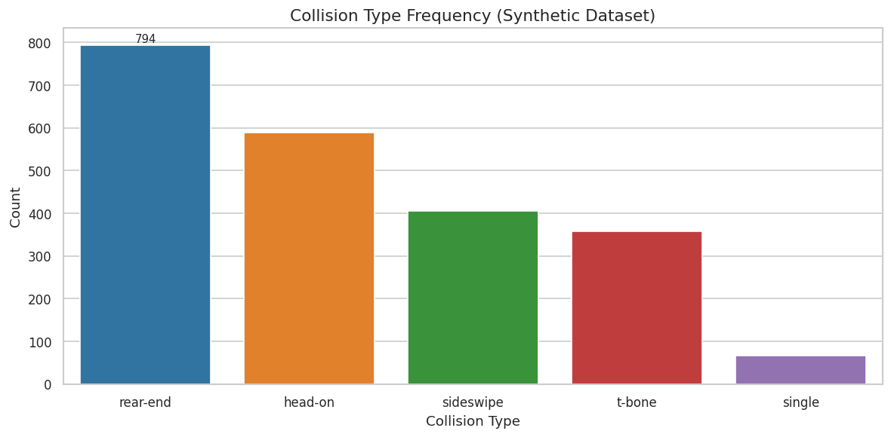
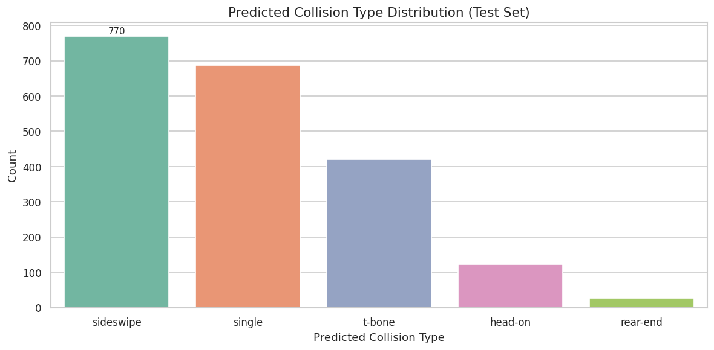

<style>
/* Make images transparent on light backgrounds */
.post-content img {
    mix-blend-mode: multiply;
}

/* Dark mode: Show original images with transparent backgrounds */
[data-theme="dark"] .post-content img {
    filter: none;
    mix-blend-mode: normal;
    border-radius: 8px;
    opacity: 0.95; /* Slightly reduce glare while maintaining contrast */
}

/* General hover effect for all links in post content */
.post-content a {
    transition: all 0.3s ease;
}
.post-content a:hover {
    color: #767676;
    text-shadow: 0px 0px 0.5px #767676;
}

/* Dark mode hover effect (same color) */
[data-theme="dark"] .post-content a:hover {
    color: #767676;
    text-shadow: 0px 0px 0.5px #767676;
}
</style>

<style>
.special-thanks {
    font-size: 0.9rem;
    color: #1a73e8; /* Standard Blue for Light Mode */
    margin-bottom: 1.5rem;
}

.special-thanks a {
    color: #1a73e8;
    text-decoration: underline;
    border: none;
    background-image: none;
    box-shadow: none;
    text-underline-offset: 3px;
    transition: all 0.3s ease;
}

.special-thanks a:hover {
    color: #767676;
    text-shadow: 0px 0px 0.5px #767676; /* Subtle glow/bolding effect without lift */
}

[data-theme="dark"] .special-thanks {
    color: #64b5f6; /* Lighter Blue for Dark Mode readability */
}

[data-theme="dark"] .special-thanks a {
    color: #64b5f6;
}

[data-theme="dark"] .special-thanks a:hover {
    color: #767676;
    text-shadow: 0px 0px 0.5px #767676;
}

.equation {
    text-align: center;
    margin: 1.4rem 0;
    font-size: 1.05rem;
}

.equation-note {
    text-align: center;
    font-size: 0.85rem;
    color: #6c6c6c;
    margin-top: -0.9rem;
    margin-bottom: 1.4rem;
}

[data-theme="dark"] .equation-note {
    color: #9b9c9d;
}
</style>

<p class="special-thanks">
Special thanks to <a href="https://github.com/sarveshtalele">Sarvesh Talele</a> for his meaningful contributions, support, and wisdom that helped shape this work.
</p>

Traffic cameras at intersections and along highways record the circumstances of a great many collisions, but the methods that read those recordings automatically are usually trained on annotated footage from the same camera. Move the camera and the method has to be retrained. This work asks a narrower question: how much of an accident can be recovered from a recording when there is no labelled real-world data at all, and nothing may be fine-tuned. The answer is a pipeline of three independent modules, one for when the collision happened, one for where in the frame it happened, and one for what kind of collision it was, running end to end on pre-trained weights alone.

This is joint work with [Sarvesh Talele](https://github.com/sarveshtalele), written for the ACCIDENT @ CVPR 2026 challenge and available as an arXiv preprint, [2604.09685](https://arxiv.org/abs/2604.09685).

---

## Introduction

Road traffic crashes kill over one million people each year [[1]](#ref-1). Surveillance cameras already record much of what happens, and if that footage could be read automatically, dispatchers would be alerted sooner and investigators would have an objective account of the scene. The obstacle is that most detection methods are supervised, and supervised on video from the deployment site itself [[2]](#ref-2) [[3]](#ref-3). Each new installation brings a different viewpoint, a different lens, different lighting and different traffic, and the annotation bill is paid again.

The ACCIDENT @ CVPR 2026 competition [[4]](#ref-4) removes that option deliberately. Development material is synthetic, rendered in the CARLA simulator [[5]](#ref-5). The test set is real CCTV, and annotating it by hand is prohibited. Anything that scores has to arrive at the real footage carrying only what it learned somewhere else.


<small><em>Chronological sampled frames from a synthetic CARLA traffic incident in the ACCIDENT @ CVPR 2026 development split. Most clips record approximately 18 seconds of motion at 20 frames per second.</em></small>

Three predictions are required for every video:

1. the accident time in seconds,
2. the normalized image coordinates of the point of impact, and
3. the collision type, drawn from five categories: head-on, rear-end, sideswipe, single-vehicle and t-bone.

We answer each with a separate module. Timing comes from statistical anomaly detection on differences between consecutive frames. Location comes from accumulated dense optical flow. Type comes from CLIP [[6]](#ref-6), a vision-language model trained on 400 million image-text pairs, compared against written descriptions of each category. Because the three share no parameters, any one of them can be replaced without disturbing the others.

---

## The Competition

Scoring is the part that shapes the design. A submission is graded on the harmonic mean of three quantities.

The temporal component <i>𝒯</i> measures how close the predicted time is to the truth through a Gaussian kernel with <i>σ</i><sub><i>t</i></sub> = 2.0 seconds:

<p class="equation"><i>𝒯</i> = exp( &minus;½ ( (<i>t</i><sub>pred</sub> &minus; <i>t</i><sub>gt</sub>) / <i>σ</i><sub><i>t</i></sub> )<sup>2</sup> )</p>

The spatial component <i>𝒮</i> applies the same form, with <i>σ</i><sub><i>s</i></sub> = 0.1, to the Euclidean distance between the predicted and true impact points in normalized coordinates. The classification component <i>𝒞</i> is top-1 accuracy, so it is either 1 or 0. The final score is

<p class="equation"><i>ℋ</i> = 3 / ( 1/<i>𝒯</i> + 1/<i>𝒮</i> + 1/<i>𝒞</i> )</p>

The harmonic mean is unforgiving by construction. A zero anywhere sends the whole score to zero, which means a method cannot buy a good result by being excellent at the easy component and hopeless at the hard one. That property matters a great deal to how the results below should be read.

---

## Dataset

The development split holds 2,211 synthetic CCTV-style videos rendered in CARLA, each annotated with accident time, impact coordinates and collision type. The test split holds 2,027 real surveillance recordings gathered from public traffic camera feeds, varying in resolution, frame rate and lighting, and carrying the compression artefacts, lens distortion and partial occlusion that real installations produce.

All synthetic videos are rendered at 1920 &times; 1080 at a fixed 20 frames per second. Clip length runs from 5.8 to 32.2 seconds, with a mean of 17.7 seconds and a standard deviation of 3.9 seconds.


<small><em>Distribution of ground-truth accident times across the 2,211 synthetic videos. Most incidents occur within the first ten seconds of the clip.</em></small>

The ground-truth accident falls at a median of 6.9 seconds into the clip, with an interquartile range of 5.2 to 9.8 seconds, which places most collisions in the first half of the recording.

The five categories are far from balanced.

| Collision type | Videos | Share of split |
|---|---:|---:|
| Rear-end | 794 | 35.9% |
| Head-on | 588 | 26.6% |
| Sideswipe | 405 | 18.3% |
| T-bone | 358 | 16.2% |
| Single-vehicle | 66 | 3.0% |



<small><em>Collision type frequency in the synthetic development split. The rear-end category holds twelve times as many samples as the single-vehicle category.</em></small>

Impact coordinates are normalized to the unit square and sit close to the middle of the frame. Both <i>c</i><sub><i>x</i></sub> and <i>c</i><sub><i>y</i></sub> have means near 0.50, with standard deviations of 0.13 and 0.18 respectively.


<small><em>Ground-truth impact point distribution across 2,211 synthetic videos, coloured by collision type. Points cluster near the frame centre, with head-on and sideswipe events showing the widest spatial spread.</em></small>

That concentration is worth holding on to. It means a spatial prediction that simply guesses the centre is already not terrible, and it sets a floor that any real method has to beat before its spatial score means anything.

---

## Method

### Temporal Localization

A collision produces a sudden change in image intensity. The temporal module turns that observation into a one-dimensional signal and then looks for statistical outliers in it.

Let <i>I</i><sub><i>t</i></sub> be the grayscale frame at index <i>t</i>, resized to 180 &times; 320 for speed. The mean absolute difference between adjacent frames is

<p class="equation"><i>d</i><sub><i>t</i></sub> = (1 / <i>HW</i>) &Sigma;<sub><i>u</i>,<i>v</i></sub> | <i>I</i><sub><i>t</i>+1</sub>(<i>u</i>,<i>v</i>) &minus; <i>I</i><sub><i>t</i></sub>(<i>u</i>,<i>v</i>) |</p>

This series carries the collision, and it also carries camera shake and ordinary traffic. A centred rolling mean over a window of <i>w</i> = 5 frames suppresses the short-lived noise, and the smoothed values are then turned into z-scores against the mean and standard deviation of the whole series:

<p class="equation"><i>z</i><sub><i>t</i></sub> = ( <span style="text-decoration: overline;"><i>d</i></span><sub><i>t</i></sub> &minus; <i>μ</i> ) / ( <i>σ</i> + <i>ε</i> )</p>

<p class="equation-note">with <i>ε</i> = 10<sup>&minus;8</sup> to keep the denominator away from zero</p>

Any frame whose <i>z</i><sub><i>t</i></sub> exceeds a threshold <i>τ</i> = 1.5 becomes a candidate, and the candidate with the strongest score wins. If nothing crosses the threshold, the module falls back to the global maximum, so it always returns an answer. The predicted time in seconds is the winning frame index divided by the frame rate.


<small><em>Temporal localization on a synthetic CARLA video. Above, the mean absolute frame difference across all frames. Below, the z-score anomaly series after rolling-mean smoothing, with the dashed line marking the detection threshold.</em></small>

The pair of charts shows why the smoothing step earns its place. The raw signal mixes a slow drift, produced by vehicles moving through the scene, with sharp transients. After smoothing and normalization the shape of the event survives while the isolated single-frame spikes do not.

### Spatial Impact Localization

A collision concentrates high-magnitude motion into a small part of the image. The spatial module finds that part by accumulating dense optical flow over a short window and taking the weighted centroid of the result.

When the temporal module has produced a time, a 30-frame window is centred on the corresponding frame. Otherwise the window starts at frame &lfloor;<i>N</i>/3&rfloor;. Each consecutive pair inside the window is passed through the Farnebäck dense optical flow algorithm [[7]](#ref-7) at 320 &times; 180, which estimates per-pixel displacement using quadratic polynomial expansions over a multi-scale Gaussian pyramid. The displacement magnitudes are summed across the window:

<p class="equation"><i>M</i>(<i>u</i>,<i>v</i>) = &Sigma;<sub><i>t</i></sub> &radic;( <i>f</i><sub><i>x</i></sub><sup>2</sup>(<i>u</i>,<i>v</i>,<i>t</i>) + <i>f</i><sub><i>y</i></sub><sup>2</sup>(<i>u</i>,<i>v</i>,<i>t</i>) )</p>

Everything below the 90th percentile of <i>M</i> is then set to zero. This is the step that separates a collision from busy traffic: diffuse motion spread across the frame is discarded, and only the dense high-magnitude cluster survives. The impact point is the weighted centroid of what remains, normalized to the unit square:

<p class="equation"><i>c</i><sub><i>x</i></sub> = (1/<i>W</i>) &middot; &Sigma; <i>v</i> &middot; <i>M</i>(<i>u</i>,<i>v</i>) / &Sigma; <i>M</i>(<i>u</i>,<i>v</i>) &nbsp;&nbsp;&nbsp; <i>c</i><sub><i>y</i></sub> = (1/<i>H</i>) &middot; &Sigma; <i>u</i> &middot; <i>M</i>(<i>u</i>,<i>v</i>) / &Sigma; <i>M</i>(<i>u</i>,<i>v</i>)</p>

If the total falls below 10<sup>&minus;6</sup>, the module returns the frame centre. The calculation is a special case of the image moment framework of Hu [[8]](#ref-8), applied to flow magnitudes rather than pixel intensities.


<small><em>Cumulative Farnebäck optical flow magnitude after 90th-percentile thresholding. The bright region corresponds to the collision area, and diffuse background motion has been suppressed.</em></small>

### Collision Type Classification

CLIP [[6]](#ref-6) learns a shared embedding space for images and text by contrastive training on 400 million image-text pairs. At test time an image embedding can be compared against text embeddings of candidate class names by cosine similarity, which gives a classifier with no task-specific training data behind it.

For each of the five types we write five short descriptions of the collision as a bystander would put it. Every prompt is encoded, L2-normalized and averaged into a single vector for that class, which reduces the influence of any one wording [[6]](#ref-6) [[9]](#ref-9). These vectors are computed once and cached before any video is read.

| Type | Example prompt |
|---|---|
| Head-on | "two cars colliding head-on from opposite directions" |
| Rear-end | "a car colliding into the back of another car" |
| Sideswipe | "two vehicles scraping alongside each other" |
| Single-vehicle | "a single car crashing into a wall or obstacle" |
| T-bone | "a car hitting the side of another car at an intersection" |

At inference, eight frames centred on the predicted accident time are passed through the CLIP visual encoder (ViT-B/32), L2-normalized and averaged into one representation <b>v</b>. The predicted type is the class whose text vector gives the highest cosine similarity with <b>v</b>.

---

## Implementation

Inference runs on a single NVIDIA T4 GPU on the Kaggle platform. No weights are trained or fine-tuned on either split. Processing all 2,027 test videos takes roughly two hours.

The hyperparameters were chosen by inspecting a handful of synthetic videos and then held fixed for every test prediction.

| Component | Parameter | Value |
|---|---|---|
| Temporal | Smoothing window <i>w</i> | 5 |
| Temporal | Z-score threshold <i>τ</i> | 1.5 |
| Spatial | Start frame | centred on <i>t</i>* |
| Spatial | Context window | 30 frames |
| Spatial | Pyramid scale | 0.5 |
| Spatial | Pyramid levels | 3 |
| Spatial | Window size | 15 |
| Spatial | Flow percentile threshold | 90th |
| Classification | CLIP backbone | ViT-B/32 |
| Classification | Peak-region frames | 8 |

---

## Results

The pipeline scores **0.2523** on the public leaderboard, computed on approximately 25% of the real CCTV test set. The final ranking uses the remaining 75%, so the standing can still move.

The more useful number is the breakdown. On a ten-video calibration subset drawn from the synthetic split:

| Component | Mean score | Best individual |
|---|---:|---:|
| Temporal <i>𝒯</i> | 0.438 | 0.94 |
| Spatial <i>𝒮</i> | 0.168 | 0.96 |
| Classification <i>𝒞</i> | 0.0 | 0.0 |

Two things are worth separating here. The best individual temporal score of 0.94 and best spatial score of 0.96 show that when the pipeline locks on to the right event, both estimates can be accurate. The composite on this subset is nevertheless zero, because every one of those ten calibration videos is a head-on collision and CLIP answers t-bone for all ten. Under a harmonic mean, one component at zero settles the matter.

That is a property of the calibration subset rather than a claim about the whole test set, and it should not be read as the pipeline scoring zero in general. It does, however, point straight at where the loss is concentrated.



<small><em>Predicted collision type distribution across the 2,027 real test videos. Sideswipe and single-vehicle dominate the predictions, while rear-end is almost never selected, inverting the synthetic distribution.</em></small>

The predicted distribution inverts the training distribution almost exactly. Sideswipe is chosen for 770 of 2,027 videos and single-vehicle for 687, while rear-end, the most common category in the synthetic split at 794 videos, is chosen 23 times.

| Collision type | Synthetic split | Predicted on test |
|---|---:|---:|
| Rear-end | 794 | 23 |
| Head-on | 588 | 122 |
| Sideswipe | 405 | 770 |
| T-bone | 358 | 425 |
| Single-vehicle | 66 | 687 |

A shift of that size is not a small calibration error. It says that CLIP's similarity scores here are responding to viewing angle and scene geometry rather than to the dynamics of the collision itself.

---

## Error Analysis

Three failure patterns account for most of the loss.

**Temporal.** The frame-difference signal cannot tell a collision from any other sudden change in the image. Swaying vegetation, cloud shadows crossing the road and camera shake all produce spikes of comparable magnitude, and the module has no way to prefer one over another.

**Spatial.** The centroid is an average, so it drifts whenever several vehicles are moving at once: the weighted mean spreads across every active region instead of settling on one. The central clustering of true impact points, visible in the scatter above, is what keeps these drifted predictions from being worse than they are.

**Classification.** This is the bottleneck. CLIP was trained on internet photographs taken at roughly eye level, and CCTV views are overhead or steeply oblique. The model is being asked to recognise a geometry it has hardly seen, and the inverted prediction distribution is the visible symptom.

---

## What Would Improve It

The modular structure is what makes the next step cheap, because each part can be replaced on its own.

Two directions look most promising. Replacing Farnebäck with a learned estimator such as RAFT [[10]](#ref-10) should improve displacement accuracy at the low resolutions the pipeline runs at. More importantly, fine-tuning the CLIP visual encoder on the synthetic split would attack the domain gap between internet imagery and surveillance stills directly, and that gap is the largest single source of loss identified above.

---

## Conclusion

The pipeline detects, localizes and classifies traffic accidents in CCTV footage without a single fine-tuned weight, reaching a public leaderboard score of 0.2523. Timing comes from z-score peak detection on frame differences, location from thresholded Farnebäck optical flow reduced to a weighted centroid, and type from CLIP embeddings matched against multi-prompt text descriptions.

Read as a whole, the result is a fair account of what general-purpose pre-training currently supplies for free. The two components built from classical signal processing behave, and can be accurate when they lock on to the right event. The component that leans on a large pre-trained model is the one that fails, and it fails in a structured, legible way that names its own remedy.

---

## Preprint

<div style="position: relative; width: 100%; height: 0; padding-bottom: 129%; margin-bottom: 20px;">
    <iframe src="/posts/2026-04-05-a-modular-zero-shot-pipeline-for-accident-detection-localization-and-classification/ACCIDENT%20-%20CVPR%202026/arXiv%202604.09685%20-%20A%20Modular%20Zero-Shot%20Pipeline.pdf" style="position: absolute; top: 0; left: 0; width: 100%; height: 100%; border: none;" allowfullscreen></iframe>
</div>

---

## Additional Resources

### Preprint, Code, and Competition

The preprint, the notebook that produced every number above, and the competition itself:

<div style="display: flex; flex-direction: column; gap: 8px;">

  <div>
    <!-- arXiv Icon -->
    <svg xmlns="http://www.w3.org/2000/svg" width="20" height="20" viewBox="0 0 24 24" fill="none" stroke="currentColor" stroke-width="2" stroke-linecap="round" stroke-linejoin="round" style="vertical-align: middle; margin-right: 8px;"><path d="M4 19.5A2.5 2.5 0 0 1 6.5 17H20"></path><path d="M6.5 2H20v20H6.5A2.5 2.5 0 0 1 4 19.5v-15A2.5 2.5 0 0 1 6.5 2z"></path></svg>
    <a href="https://arxiv.org/abs/2604.09685" target="_blank">Preprint (arXiv:2604.09685)</a>
  </div>

  <div>
    <!-- File Icon -->
    <svg xmlns="http://www.w3.org/2000/svg" width="20" height="20" viewBox="0 0 24 24" fill="none" stroke="currentColor" stroke-width="2" stroke-linecap="round" stroke-linejoin="round" style="vertical-align: middle; margin-right: 8px;"><path d="M14 2H6a2 2 0 0 0-2 2v16a2 2 0 0 0 2 2h12a2 2 0 0 0 2-2V8z"></path><polyline points="14 2 14 8 20 8"></polyline><line x1="16" y1="13" x2="8" y2="13"></line><line x1="16" y1="17" x2="8" y2="17"></line><polyline points="10 9 9 9 8 9"></polyline></svg>
    <a href="https://arxiv.org/pdf/2604.09685v1" target="_blank">Preprint (PDF)</a>
  </div>

  <div>
    <!-- GitHub Icon -->
    <svg xmlns="http://www.w3.org/2000/svg" width="20" height="20" viewBox="0 0 24 24" fill="none" stroke="currentColor" stroke-width="2" stroke-linecap="round" stroke-linejoin="round" style="vertical-align: middle; margin-right: 8px;"><path d="M9 19c-5 1.5-5-2.5-7-3m14 6v-3.87a3.37 3.37 0 0 0-.94-2.61c3.14-.35 6.44-1.54 6.44-7A5.44 5.44 0 0 0 20 4.77 5.07 5.07 0 0 0 19.91 1S18.73.65 16 2.48a13.38 13.38 0 0 0-7 0C6.27.65 5.09 1 5.09 1A5.07 5.07 0 0 0 5 4.77a5.44 5.44 0 0 0-1.5 3.78c0 5.42 3.3 6.61 6.44 7A3.37 3.37 0 0 0 9 18.13V22"></path></svg>
    <a href="https://github.com/sarveshtalele/ACCIDENT-CVPR_2026" target="_blank">Source Repository (LaTeX, notebook, figures)</a>
  </div>

  <div>
    <!-- Notebook Icon -->
    <svg xmlns="http://www.w3.org/2000/svg" width="20" height="20" viewBox="0 0 24 24" fill="none" stroke="currentColor" stroke-width="2" stroke-linecap="round" stroke-linejoin="round" style="vertical-align: middle; margin-right: 8px;"><path d="M4 19.5A2.5 2.5 0 0 1 6.5 17H20"></path><path d="M6.5 2H20v20H6.5A2.5 2.5 0 0 1 4 19.5v-15A2.5 2.5 0 0 1 6.5 2z"></path><line x1="8" y1="7" x2="16" y2="7"></line><line x1="8" y1="11" x2="14" y2="11"></line></svg>
    <a href="https://www.kaggle.com/code/ameythakur20/zero-shot-cctv-traffic-accident-understanding/" target="_blank">Kaggle Notebook (runs end to end)</a>
  </div>

  <div>
    <!-- Trophy Icon -->
    <svg xmlns="http://www.w3.org/2000/svg" width="20" height="20" viewBox="0 0 24 24" fill="none" stroke="currentColor" stroke-width="2" stroke-linecap="round" stroke-linejoin="round" style="vertical-align: middle; margin-right: 8px;"><path d="M6 9H4.5a2.5 2.5 0 0 1 0-5H6"></path><path d="M18 9h1.5a2.5 2.5 0 0 0 0-5H18"></path><path d="M4 22h16"></path><path d="M10 14.66V17c0 .55-.47.98-.97 1.21C7.85 18.75 7 20.24 7 22"></path><path d="M14 14.66V17c0 .55.47.98.97 1.21C16.15 18.75 17 20.24 17 22"></path><path d="M18 2H6v7a6 6 0 0 0 12 0V2Z"></path></svg>
    <a href="https://kaggle.com/competitions/accident" target="_blank">ACCIDENT @ CVPR 2026 Competition</a>
  </div>

  <div>
    <!-- Presentation Icon -->
    <svg xmlns="http://www.w3.org/2000/svg" width="20" height="20" viewBox="0 0 24 24" fill="none" stroke="currentColor" stroke-width="2" stroke-linecap="round" stroke-linejoin="round" style="vertical-align: middle; margin-right: 8px;"><path d="M2 3h20"></path><path d="M21 3v11a2 2 0 0 1-2 2H5a2 2 0 0 1-2-2V3"></path><path d="m7 21 5-5 5 5"></path></svg>
    <a href="https://wad.vision/" target="_blank">AUTOPILOT Workshop at CVPR 2026</a>
  </div>

  <div>
    <!-- ORCID Icon -->
    <svg xmlns="http://www.w3.org/2000/svg" width="20" height="20" viewBox="0 0 24 24" fill="currentColor" stroke="none" style="vertical-align: middle; margin-right: 8px;"><path d="M12 0C5.372 0 0 5.372 0 12s5.372 12 12 12 12-5.372 12-12S18.628 0 12 0zM7.369 17.532H5.845V7.917h1.524v9.615zM6.607 6.611a.884.884 0 1 1 0-1.768.884.884 0 0 1 0 1.768zm4.203 10.921H9.286V7.917h3.635c3.462 0 4.982 2.473 4.982 4.812 0 2.541-1.986 4.803-4.967 4.803H10.81zm.019-8.256v6.898h1.696c2.418 0 3.522-1.464 3.522-3.445 0-1.815-1.156-3.453-3.522-3.453h-1.696z"/></svg>
    <a href="https://orcid.org/0000-0001-5644-1575" target="_blank">Amey Thakur (ORCID)</a>
  </div>

  <div>
    <!-- ORCID Icon -->
    <svg xmlns="http://www.w3.org/2000/svg" width="20" height="20" viewBox="0 0 24 24" fill="currentColor" stroke="none" style="vertical-align: middle; margin-right: 8px;"><path d="M12 0C5.372 0 0 5.372 0 12s5.372 12 12 12 12-5.372 12-12S18.628 0 12 0zM7.369 17.532H5.845V7.917h1.524v9.615zM6.607 6.611a.884.884 0 1 1 0-1.768.884.884 0 0 1 0 1.768zm4.203 10.921H9.286V7.917h3.635c3.462 0 4.982 2.473 4.982 4.812 0 2.541-1.986 4.803-4.967 4.803H10.81zm.019-8.256v6.898h1.696c2.418 0 3.522-1.464 3.522-3.445 0-1.815-1.156-3.453-3.522-3.453h-1.696z"/></svg>
    <a href="https://orcid.org/0009-0002-0818-461X" target="_blank">Sarvesh Talele (ORCID)</a>
  </div>

</div>

---

## Citation

**Please cite this work as:**

<pre style="white-space: pre-wrap;"><code>Thakur, Amey, and Sarvesh Talele. "A Modular Zero-Shot Pipeline for Accident Detection, Localization, and Classification in Traffic Surveillance Video". arXiv preprint arXiv:2604.09685 (Apr 2026). https://arxiv.org/abs/2604.09685.</code></pre>

**Or use the BibTex citation:**

```
@article{thakur2026accident,
  title   = "A Modular Zero-Shot Pipeline for Accident Detection, Localization, and Classification in Traffic Surveillance Video",
  author  = "Thakur, Amey and Talele, Sarvesh",
  journal = "arXiv preprint arXiv:2604.09685",
  year    = "2026",
  month   = "Apr",
  url     = "https://arxiv.org/abs/2604.09685"
}
```

---

## References

<style>
.reference-container {
    padding-left: 0;
}
.reference-item {
    display: flex;
    margin-bottom: 0.8rem;
}
.reference-num {
    flex: 0 0 45px; /* Fixed width for the number column */
    font-weight: bold;
    color: inherit;
}
.reference-text {
    flex: 1; /* Takes remaining space */
}
</style>

<div class="reference-container">

<div class="reference-item">
    <span class="reference-num">[1]</span>
    <span class="reference-text"><a id="ref-1"></a><b>World Health Organization</b>, "Global Status Report on Road Safety 2023," <i>World Health Organization</i>, Geneva, 2023, <a href="https://www.who.int/publications/i/item/9789240086517">https://www.who.int/publications/i/item/9789240086517</a> [Accessed: Apr. 5, 2026].</span>
</div>

<div class="reference-item">
    <span class="reference-num">[2]</span>
    <span class="reference-text"><a id="ref-2"></a><b>W. Sultani, C. Chen, and M. Shah</b>, "Real-World Anomaly Detection in Surveillance Videos," <i>IEEE Conference on Computer Vision and Pattern Recognition</i>, pp. 6479-6488, 2018, DOI: <a href="https://doi.org/10.1109/CVPR.2018.00678">10.1109/CVPR.2018.00678</a> [Accessed: Apr. 5, 2026].</span>
</div>

<div class="reference-item">
    <span class="reference-num">[3]</span>
    <span class="reference-text"><a id="ref-3"></a><b>Y. Yao, X. Wang, M. Xu, Z. Pu, Y. Wang, E. Atkins, and D. Crandall</b>, "DoTA: Unsupervised Detection of Traffic Anomaly in Driving Videos," <i>IEEE Transactions on Pattern Analysis and Machine Intelligence</i>, vol. 44, no. 1, pp. 15-31, 2022, DOI: <a href="https://doi.org/10.1109/TPAMI.2022.3150763">10.1109/TPAMI.2022.3150763</a> [Accessed: Apr. 5, 2026].</span>
</div>

<div class="reference-item">
    <span class="reference-num">[4]</span>
    <span class="reference-text"><a id="ref-4"></a><b>L. Picek, V. Čermák, et al.</b>, "ACCIDENT @ CVPR: Zero-Shot Accident Detection from Traffic Surveillance Videos," <i>Kaggle Competition</i>, 2026, <a href="https://kaggle.com/competitions/accident">https://kaggle.com/competitions/accident</a> [Accessed: Apr. 5, 2026].</span>
</div>

<div class="reference-item">
    <span class="reference-num">[5]</span>
    <span class="reference-text"><a id="ref-5"></a><b>A. Dosovitskiy, G. Ros, F. Codevilla, A. Lopez, and V. Koltun</b>, "CARLA: An Open Urban Driving Simulator," <i>Conference on Robot Learning</i>, pp. 1-16, PMLR, 2017, <a href="https://proceedings.mlr.press/v78/dosovitskiy17a.html">https://proceedings.mlr.press/v78/dosovitskiy17a.html</a> [Accessed: Apr. 5, 2026].</span>
</div>

<div class="reference-item">
    <span class="reference-num">[6]</span>
    <span class="reference-text"><a id="ref-6"></a><b>A. Radford, J. W. Kim, C. Hallacy, A. Ramesh, G. Goh, S. Agarwal, G. Sastry, A. Askell, P. Mishkin, J. Clark, G. Krueger, and I. Sutskever</b>, "Learning Transferable Visual Models from Natural Language Supervision," <i>International Conference on Machine Learning</i>, pp. 8748-8763, PMLR, 2021, <a href="https://arxiv.org/abs/2103.00020">https://arxiv.org/abs/2103.00020</a> [Accessed: Apr. 5, 2026].</span>
</div>

<div class="reference-item">
    <span class="reference-num">[7]</span>
    <span class="reference-text"><a id="ref-7"></a><b>G. Farnebäck</b>, "Two-Frame Motion Estimation Based on Polynomial Expansion," <i>Scandinavian Conference on Image Analysis</i>, pp. 363-370, Springer, 2003, DOI: <a href="https://doi.org/10.1007/3-540-45103-X_50">10.1007/3-540-45103-X_50</a> [Accessed: Apr. 5, 2026].</span>
</div>

<div class="reference-item">
    <span class="reference-num">[8]</span>
    <span class="reference-text"><a id="ref-8"></a><b>M.-K. Hu</b>, "Visual Pattern Recognition by Moment Invariants," <i>IRE Transactions on Information Theory</i>, vol. 8, no. 2, pp. 179-187, 1962, DOI: <a href="https://doi.org/10.1109/TIT.1962.1057692">10.1109/TIT.1962.1057692</a> [Accessed: Apr. 5, 2026].</span>
</div>

<div class="reference-item">
    <span class="reference-num">[9]</span>
    <span class="reference-text"><a id="ref-9"></a><b>K. Zhou, J. Yang, C. C. Loy, and Z. Liu</b>, "Learning to Prompt for Vision-Language Models," <i>International Journal of Computer Vision</i>, vol. 130, no. 9, pp. 2337-2348, 2022, DOI: <a href="https://doi.org/10.1007/s11263-022-01653-1">10.1007/s11263-022-01653-1</a> [Accessed: Apr. 5, 2026].</span>
</div>

<div class="reference-item">
    <span class="reference-num">[10]</span>
    <span class="reference-text"><a id="ref-10"></a><b>Z. Teed and J. Deng</b>, "RAFT: Recurrent All-Pairs Field Transforms for Optical Flow," <i>European Conference on Computer Vision</i>, pp. 402-419, Springer, 2020, DOI: <a href="https://doi.org/10.1007/978-3-030-58536-5_24">10.1007/978-3-030-58536-5_24</a> [Accessed: Apr. 5, 2026].</span>
</div>

<div class="reference-item">
    <span class="reference-num">[11]</span>
    <span class="reference-text"><a id="ref-11"></a><b>A. Thakur and S. Talele</b>, "Zero-Shot CCTV Traffic Accident Understanding," <i>Kaggle Notebook</i>, 2026, <a href="https://www.kaggle.com/code/ameythakur20/zero-shot-cctv-traffic-accident-understanding">https://www.kaggle.com/code/ameythakur20/zero-shot-cctv-traffic-accident-understanding</a> [Accessed: Apr. 5, 2026].</span>
</div>

</div>
