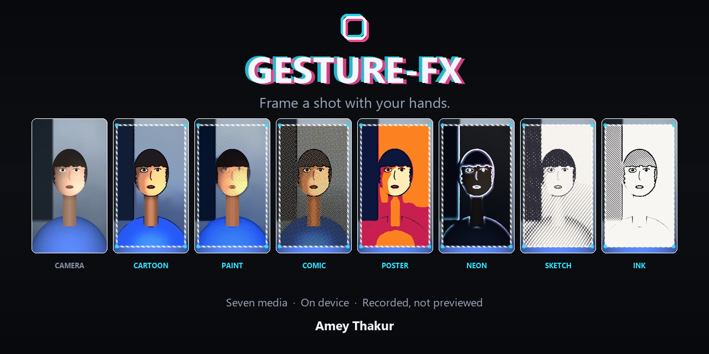
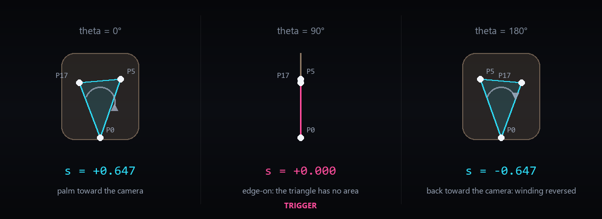
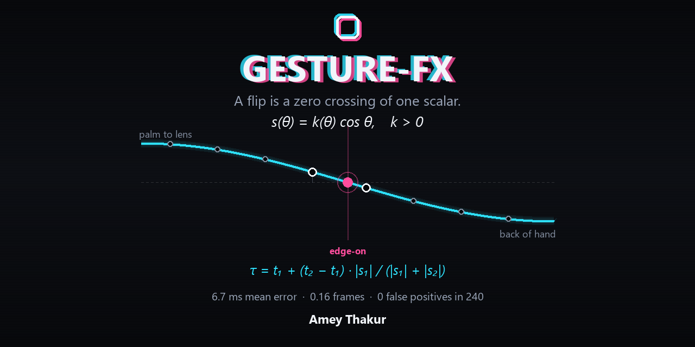
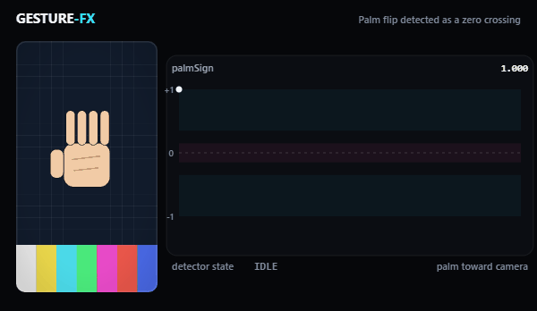
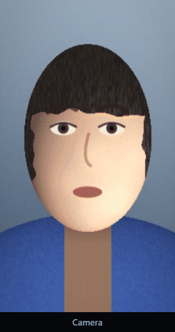

<style>
/* Make images transparent on light backgrounds */
.post-content img {
    mix-blend-mode: multiply;
}

/* Dark mode: Show original images with transparent backgrounds */
[data-theme="dark"] .post-content img {
    filter: none;
    mix-blend-mode: normal;
    border-radius: 8px;
    opacity: 0.95; /* Slightly reduce glare while maintaining contrast */
}

.equation {
    text-align: center;
    margin: 1.4rem 0;
    font-size: 1.05rem;
}

.equation-note {
    text-align: center;
    font-size: 0.85rem;
    color: #6c6c6c;
    margin-top: -0.9rem;
    margin-bottom: 1.4rem;
}

[data-theme="dark"] .equation-note {
    color: #9b9c9d;
}

/* General hover effect for all links in post content */
.post-content a {
    transition: all 0.3s ease;
}
.post-content a:hover {
    color: #767676;
    text-shadow: 0px 0px 0.5px #767676;
}

/* Dark mode hover effect (same color) */
[data-theme="dark"] .post-content a:hover {
    color: #767676;
    text-shadow: 0px 0px 0.5px #767676;
}
</style>



<div align="center">

**[Paper (PDF)](https://github.com/Amey-Thakur/GESTURE-FX/blob/main/paper/main.pdf)** &nbsp;·&nbsp;
**[Code](https://github.com/Amey-Thakur/GESTURE-FX)** &nbsp;·&nbsp;
**[Live demo](https://amey-thakur.github.io/GESTURE-FX/)**

</div>

## Abstract

Gesture recognition on video is normally posed as classification: assign a label
to each frame, then act on the label. That formulation is adequate for control,
where a command may be obeyed several frames late without a user noticing, and
inadequate for **synchronisation**, where an output must be aligned to the frame
on which the gesture physically occurred. This work takes the synchronisation
problem for a specific and common movement, the rotation of an open hand about
its own long axis, and shows that it admits an exact solution requiring no
classifier, no training data and no calibration.

Let <i>s</i> denote the normalised two-dimensional cross product of the two palm
edges, taken at the wrist and the two outer knuckles, under the projection the
camera already performs. We prove that <i>s</i> factorises as
<i>k</i>(<i>θ</i>) cos <i>θ</i> with |<i>k</i>(<i>θ</i>)| &gt; 0 everywhere, so
that <i>s</i> vanishes if and only if the palm is edge-on and its sign tracks the
face presented to the camera. Detecting the gesture therefore reduces to locating
a zero crossing of a single scalar, which yields an instant rather than an
interval. We further prove that the criterion is invariant to image mirroring, to
hand scale and to handedness, and that these follow from the algebraic form
rather than from any property of the estimator supplying the landmarks.

A second, two-handed interaction uses four fingertips as the corners of a window
onto a restyled version of the same scene. We give the coverage predicate this
requires, showing that the triangulation ordinarily used is unsound the moment
the hands cross and that an even-odd test is both correct there and cheaper, and
we derive the three operators that fill the window.

Against a corpus with exact ground truth the criterion detects 95% of flips with
no false positive in 240 near-miss sequences, and places each detection within
6.7 ms on average of the instant it occurred: a sixth of the interval at which
the hand is observed.

## Introduction

A gesture recogniser that drives an interface is judged by whether it eventually
fires. A gesture recogniser that drives a *visual effect inside a recording* is
judged by *when* it fires, because the viewer sees the gesture and its
consequence in the same footage and will attribute one to the other only if they
coincide. An effect placed two hundred milliseconds after a hand movement does
not read as caused by it. It reads as a coincidence.

This distinction is not usually drawn. The dominant formulation labels frames and
acts on labels [[1]](#ref-1) [[2]](#ref-2), which returns an interval during
which a gesture was judged to be in progress. Recovering a single instant from
such an interval is not well posed: the interval's boundaries are artefacts of
the classifier's confidence profile, and that profile is at its worst exactly
where the instant lies. During the fast middle of a hand rotation the hand is
motion blurred and self-occluding, so a classifier is least certain precisely
when certainty is required.

We show that for one important gesture the instant can be obtained directly, and
exactly, from projective geometry.

### Contributions

1. A criterion for detecting the rotation of an open hand about its long axis as
   the **zero crossing of a single scalar** computed from three landmarks, with a
   proof that the crossing coincides exactly with the edge-on configuration.
2. Proofs that the criterion is **invariant** under image mirroring, under
   uniform scaling of the hand, and under exchange of handedness, all following
   from its algebraic form rather than from the landmark estimator.
3. A **coverage predicate** for the two-hand window that remains correct when the
   quadrilateral self-intersects, with the exact area by which the triangulation
   it replaces overdraws in that case.
4. An **analytic realisation of the three-representation cartoon decomposition**,
   in which each of the three free parameters is fixed by a derived quantity
   rather than by inspection: the range schedule by the expected attenuation
   under sensor noise, the band-selection neighbourhood by the quantiser's slope,
   and the contour operator's mixing fraction by its closed-form noise response.
5. **Sub-frame localisation** of the event by interpolating the zero between the
   two samples that bracket it, with a proof that the error is second order in
   the sampling interval where reporting either sample is first order, and a
   measurement showing mean absolute error falling from 23.0 ms to 6.7 ms.
6. **A generated corpus with exact ground truth**, and the argument for
   generating rather than filming it, which is that the crossing frame is not
   observable in video to a precision finer than the quantity being measured.
7. A **rate-decoupled compositing architecture** in which a trigger carries the
   timestamp of its cause, making the smoothness of the response independent of
   inference throughput.
8. A **bounded temporal buffer** permitting retrospective compositing, which
   obtains an effect otherwise requiring generative synthesis from information
   the stream has already delivered.
9. A statement of the condition under which a window tracked in one clip may be
   composited over a generatively restyled version of it, and of **why that
   condition can be requested but not enforced**.
10. A complete client-side implementation, released under the MIT licence, with
    the components that were verified and those that were not **reported
    separately**.

## Problem Formulation

Let <i>V</i> = (<i>I</i><sub>1</sub>, <i>I</i><sub>2</sub>, …) be a video stream
with frame <i>I</i><sub><i>t</i></sub> observed at time <i>t</i>, and let
<i>Λ</i> be a landmark estimator producing, for each observed frame, hand
landmark configurations in normalised image coordinates.

**Definition (synchronisation problem).** Given a gesture occurring physically
over the interval [<i>t</i><sub><i>a</i></sub>, <i>t</i><sub><i>b</i></sub>] with
a distinguished instant <i>t</i>*, produce an estimate of <i>t</i>* and a
composited stream in which a designated transformation is applied from that
estimate onward, such that the error is below perceptual tolerance and the stream
is encoded **without a subsequent editing stage**.

Three constraints distinguish this from classification.

**The instant is the deliverable.** A classifier estimates the support
[<i>t</i><sub><i>a</i></sub>, <i>t</i><sub><i>b</i></sub>]. Reducing that support
to a point requires a rule the classifier does not supply, and any such rule is
sensitive to the confidence profile at the boundaries.

**Evidence is worst where it is needed.** The instant lies in the interior of the
movement, where angular velocity is highest, where motion blur is greatest, and
where self-occlusion is most severe. Landmark confidence is therefore minimised
at exactly the instant to be recovered.

**Inference and presentation compete.** Let <i>C</i><sub><i>Λ</i></sub> be the
per-frame cost of landmark estimation and <i>C</i><sub><i>R</i></sub> that of
rendering. Evaluating both at the display rate <i>f</i><sub><i>d</i></sub>
requires <i>f</i><sub><i>d</i></sub>(<i>C</i><sub><i>Λ</i></sub> +
<i>C</i><sub><i>R</i></sub>), and since <i>C</i><sub><i>Λ</i></sub> greatly
exceeds <i>C</i><sub><i>R</i></sub> on commodity hardware, this caps the system
at the inference rate.

## Method

### The projected palm winding

Take three landmarks: the wrist, and the two outer knuckles at the index and
little fingers. These define two edges of the palm. The camera has already
projected them, so what is available is their projection, not their true
three-dimensional configuration.

Let <i>s</i> be the normalised two-dimensional cross product of those two
projected edges: the signed area of the parallelogram they span, divided by the
product of their lengths. It is a pure number, independent of how large the hand
appears in frame.



<small><em>The construction. Two palm edges from three landmarks, and the normalised signed area they span. Its zero is the instant the palm is edge-on to the camera.</em></small>

### The crossing theorem

The result the rest of the method rests on is that <i>s</i> factorises:

<p class="equation"><i>s</i>(<i>θ</i>) = <i>k</i>(<i>θ</i>) cos <i>θ</i></p>

<p class="equation-note">with |<i>k</i>(<i>θ</i>)| &gt; 0 for every <i>θ</i>, which is what makes the factorisation useful</p>

Two consequences follow immediately, and neither is an approximation.

**<i>s</i> vanishes if and only if the palm is edge-on.** Because <i>k</i> never
vanishes, the zeros of <i>s</i> are exactly the zeros of cos <i>θ</i>. The scalar
is zero at the precise orientation where the palm presents its edge to the
camera, and nowhere else.

**The sign of <i>s</i> tracks which face is presented.** Either side of that
zero the sign is determined, so a change of sign is a flip and nothing else is.

Detecting the gesture therefore reduces to locating a zero crossing of a single
scalar. That is a different kind of object from a classifier's output. A
classifier tells you a label held over some frames. A zero crossing tells you
*when*, and it can tell you so more finely than the rate at which you sampled.



<small><em>The method in one card. Three landmarks, one scalar, and the crossing that dates the gesture.</em></small>

### Invariance

Three invariances matter in practice, and all three are properties of the
algebraic form rather than of whatever estimator supplies the landmarks.

**Mirroring.** A mirrored image negates <i>s</i>. It does not move its zeros, so
a front-facing camera that mirrors its preview needs no special case.

**Scale.** The normalisation divides out both edge lengths, so the distance of
the hand from the camera is irrelevant.

**Handedness.** A left hand and a right hand differ in the sign of <i>s</i>, not
in where it vanishes.

This is the reason the method needs no calibration. The invariances are not
empirical observations that happened to hold across a test set. They follow from
the expression, so they hold for any hand, any camera, and any landmark estimator
that returns the three points.

### Recovering the instant between samples

Landmark inference is expensive and is therefore run well below the display rate,
so the crossing almost never falls on a sample.

Because <i>s</i> is continuous and its crossing is transverse, the instant can be
recovered by interpolating between the two samples that bracket the sign change.
The error is then **second order** in the sampling interval, where reporting
either bracketing sample is first order.

| Localisation error | At the bracketing sample | Interpolated |
| :--- | ---: | ---: |
| Mean absolute error | 23.0 ms (0.55 frames) | **6.7 ms (0.16 frames)** |
| Median absolute error | 22.2 ms (0.53 frames) | 4.0 ms (0.10 frames) |
| Ninetieth percentile | 41.7 ms (1.00 frames) | 18.1 ms (0.43 frames) |
| Worst case | 66.3 ms (1.59 frames) | 26.7 ms (0.64 frames) |
| Mean signed error | −22.1 ms | +0.8 ms |

<small><em>Localisation error over the 114 detected flips, at a sampling interval of 41.7 ms. The mean signed error is the line to read: reporting at the bracketing sample is systematically late by most of a frame, and interpolation removes the bias rather than merely reducing the spread.</em></small>

Reporting an event more finely than one samples it is the practical consequence
of the whole approach, and it is not available to a classifier operating on the
same stream.

### Rate-decoupled compositing

Landmark inference is rate limited well below the display rate, and each
recognised gesture carries **the timestamp of its cause** rather than the
timestamp of the frame on which it was noticed. Presentation quality is therefore
independent of inference throughput.



<small><em>The single-hand gesture driving an effect. The effect is composited onto the recorded surface as the take is made, so there is no editing stage afterwards.</em></small>

### Retrospective compositing

A bounded temporal buffer allows an effect to be composited over footage the
stream has *already delivered*, obtaining from ordinary buffering an effect that
would otherwise require generative synthesis.


<small><em>The buffer, verified with a subject that states its own draw time. With a requested delay of 2.2 s the strip runs from a live frame at 4.3 s, through recalled frames reading 2.5, 2.8 and 2.9 s, to a live frame at 5.6 s, with the subject visibly displaced between them.</em></small>

### The two-hand frame

A second interaction uses four fingertips as the corners of a window onto a
restyled version of the same scene.



<small><em>The two-hand interaction. Four fingertips are the corners of a window, and the interior is the same scene rendered in a different medium. The window follows the hands.</em></small>

This needs a coverage predicate: given four corners, which pixels are inside? The
obvious approach is to triangulate the quadrilateral and fill the triangles. That
is unsound, and it fails exactly when the interaction is most natural.

The moment the hands cross, the boundary self-intersects. The correct answer is
then the **even-odd rule**, which renders two lobes and leaves the pinch points
between them uncovered. The triangle fan fills both lobes *and* the region
between them: for the symmetric crossing configuration it draws **half as much
area again** as the window encloses, a third of it outside the boundary
altogether.

The even-odd test is both correct there and cheaper. It is one of the few places
where the right answer costs less than the wrong one.

### Stylising the interior

Three operators fill the window, and each has one parameter that is derived
rather than chosen by eye.

**An iterated edge-preserving filter**, in the lineage of bilateral filtering
[[3]](#ref-3), whose range width must vary across iterations, fixed by the
expected attenuation under sensor noise.

**A quantiser**, whose amplification of residual noise is bounded, and whose
slope fixes the band-selection neighbourhood.

**A difference of Gaussians**, whose noise response is computed in closed form
and used to fix its one free mixing fraction.

Whether that analysis was right is measurable. A flat field was given independent
per-channel grain of ±15 of 255, a standard deviation of 8.7, delivered through
the same capture path a camera uses. The mean absolute difference between
horizontally adjacent output samples, measured well inside the window, was
**4.5 of 255 without the window and 0.2 with it**. The grain comes from a seeded
stream, so both figures are reproducible rather than merely reported.


<small><em>The effects, composited onto the recorded surface rather than the camera stream.</em></small>

Seven media are offered, and they are meant to be nameable from a still. Rather
than assert that, all twenty-one pairs were measured by mean absolute channel
difference over the window interior. The widest, neon against ink, differed by
122.7 of 255. The closest, cartoon against paint, by 7.6, against a floor of 6
fixed before the measurement.


<small><em>The seven media. The claim that they are distinguishable is measured rather than asserted, and the closest pair is named.</em></small>

That closest pair is named deliberately. Cartoon and paint share a flattened
surface and differ mainly in saturation and stroke direction, so they are the
pair a reader should expect to find closest, and 7.6 is a thinner margin than the
rest of the set enjoys. "They look different" is otherwise an assertion by an
author about their own work.

## Implementation

The system is built on MediaPipe hand landmarks [[4]](#ref-4) [[5]](#ref-5),
WebGL 2 [[6]](#ref-6), and the media capture and recording specifications
[[7]](#ref-7) [[8]](#ref-8). Landmark input is smoothed with the One Euro filter
[[9]](#ref-9), designed for exactly this trade between jitter and lag.

At 60 Hz the frame budget is 16.7 ms.

| Stage | Measured |
| :--- | ---: |
| Landmark inference | 6 to 11 ms |
| Texture upload | 1 to 2 ms |
| Effect shader | 0.5 to 2 ms |
| Feature extraction and detector evaluation, two hands, five detectors | below 0.1 ms combined |

Inference dominates, which is what makes the decoupling necessary. The criterion
itself is essentially free, consistent with it costing one cross product per
hand.

Effects composite onto the **recorded surface**, not the camera stream, so there
is no editing stage: what is recorded is what was seen. In its default
configuration the system runs entirely on the client, with no server, no key and
no per-use cost [[10]](#ref-10). Two optional paths depart from this; they are
disabled until the user enables them, and are accounted for rather than elided.

**Behavioural coverage.** Four suites totalling 164 assertions run against the
shipped modules, covering the render passes, the coverage predicate under
crossing, the framing clamp, the noise reduction, the tracker's hysteresis and
dropout behaviour, and the rest.

One suite decodes the encoded output rather than trusting the container's
declaration, and that distinction earned its cost. It caught a defect no weaker
check could see. The container was selected once at startup, before it was known
whether a take would carry sound, and the preferred string named a video codec
alone. A recorder given an explicit codec list encodes those codecs and no
others, so an attached audio track was accepted and then silently discarded. The
track was present in the stream, the file was well formed, its declared type
named the container correctly, and **every recording was mute**. Only decoding
the output distinguishes that state from a working one. The correction is to
choose the container per take, once the track set is known.

## Evaluation

The criterion was tested against 60 generated sequences per class at a landmark
rate of 24 Hz with the shipped thresholds.

| Class | Requirement | Fired | Correct |
| :--- | :--- | ---: | ---: |
| Palm flip, quick, 180 to 520 ms | must fire | 54 / 60 | 90.0% |
| Palm flip, deliberate, 0.9 to 1.6 s | must fire | 60 / 60 | 100.0% |
| Held edge-on, 0.8 to 1.4 s | must not fire | 0 / 60 | 100.0% |
| Wobble to 54 to 79 degrees | must not fire | 0 / 60 | 100.0% |
| Rotating closed hand | must not fire | 0 / 60 | 100.0% |
| Entering frame mid-rotation | must not fire | 0 / 60 | 100.0% |

<small><em>Overall: 95.0% of flips detected, and no false positive in the 240 near-miss sequences. The two flip classes differ only in how quickly the hand is turned; the quick class is the harder one, and it is where all six misses fall.</em></small>

The four near-miss classes carry the weight of this table. Each shares part of a
flip's signature without being a flip: a palm held edge-on, a wobble that stops
short of turning over, a closed hand rotating, and a hand entering the frame
already mid-rotation. A detector that fires on everything scores perfectly on the
flip classes alone, so the near misses are what make the positive result mean
anything.

**Window coverage.** The predicate was checked against the failure it replaces.
With one hand's corners exchanged, so the boundary self-intersects, the even-odd
predicate renders two lobes and leaves the pinch points untouched; the fan
predicate fills both.

## Limitations

Stated as the paper states them, because the value of a systems claim lies in
what it separates out.

**Restyling is not substitution.** The shader restyles the subject present in the
frame. It cannot replace that subject, which would require synthesising content
the stream never carried. Systems that do so route video to a hosted generative
model, reintroducing a server, a key and a per-use cost.

**Orthography.** The crossing theorem assumes orthographic projection, and the
factorisation does not hold verbatim under perspective. The qualitative
conclusion does. Three points project to collinear image points under a pinhole
camera exactly when they are coplanar with the centre of projection, so the
projected triangle still degenerates once per half turn and <i>s</i> still
changes sign there. The degeneracy occurs when the palm plane contains the centre
of projection rather than at exactly a quarter turn, and the discrepancy vanishes
as the hand approaches the optical axis. **The crossing remains exact as an
event**, with a small bias in the associated angle.

**Rotation axis.** The analysis assumes rotation about the hand's long axis. A
rotation about the optical axis leaves <i>s</i> unchanged and is correctly
ignored; a rotation about the remaining axis is not modelled, and is excluded in
practice by the finger-extension condition.

**Unverified surfaces.** No test was performed with a physical camera, with real
hands, or on Apple platforms. The thresholds are derived rather than fitted, but
**no threshold has met a human hand**. Recording on iOS is the least certain
component: the interfaces are supported and four documented defects are
mitigated, but none of it was confirmed on a device.

**The corpus is generated, not filmed.** The classification table measures the
criterion and its gating. It does not measure the landmark estimator, which
appears in the corpus as unbiased noise of constant variance and is in reality
neither. A hand also deforms as it turns, and a rigid model does not. The figures
are therefore **a floor on the error attributable to the detector**, not a
prediction of field performance.

This is the honest form of the measurement rather than a substitute for one. The
alternative, annotating filmed rotations, would report the annotator's
uncertainty about the edge-on frame, which is of the same order as the quantity
being measured.

## Conclusion

Posing a gesture as the zero of a continuous quantity rather than as a label
attached to a frame changes what the answer can be. A classifier returns an
interval over which a label held. A zero crossing returns an instant, and can
return it more precisely than the rate at which the hand was observed.

That is not a general result about gesture recognition. It is a specific result
about one movement whose projected geometry happens to factorise, and the value
lies in showing that the factorisation is exact and that its consequences,
including all three invariances, follow from the algebra rather than from the
estimator or the data.

## Citation

**Please cite this work as:**

<pre style="white-space: pre-wrap;"><code>Thakur, Amey. "Frame-Synchronous Hand Gesture Detection by Projected Winding Order" (Aug 2026). https://github.com/Amey-Thakur/GESTURE-FX.</code></pre>

**Or use the BibTex citation:**

```
@article{thakur2026winding,
  title   = "Frame-Synchronous Hand Gesture Detection by Projected Winding Order",
  author  = "Thakur, Amey",
  year    = "2026",
  month   = "Aug",
  url     = "https://github.com/Amey-Thakur/GESTURE-FX"
}
```

---

## References

<style>
.reference-container {
    padding-left: 0;
}
.reference-item {
    display: flex;
    margin-bottom: 0.8rem;
}
.reference-num {
    flex: 0 0 45px; /* Fixed width for the number column */
    font-weight: bold;
    color: inherit;
}
.reference-text {
    flex: 1; /* Takes remaining space */
}
</style>

<div class="reference-container">

<div class="reference-item">
    <span class="reference-num">[1]</span>
    <span class="reference-text"><a id="ref-1"></a><b>O. K&ouml;p&uuml;kl&uuml;, A. Gunduz, N. Kose, and G. Rigoll</b>, "Real-time Hand Gesture Detection and Classification Using Convolutional Neural Networks," <i>arXiv preprint arXiv:1901.10323</i>, 2019, <a href="https://doi.org/10.48550/arXiv.1901.10323">https://doi.org/10.48550/arXiv.1901.10323</a> [Accessed: Aug. 31, 2026].</span>
</div>

<div class="reference-item">
    <span class="reference-num">[2]</span>
    <span class="reference-text"><a id="ref-2"></a><b>Z. Shou, D. Wang, and S.-F. Chang</b>, "Temporal Action Localization in Untrimmed Videos via Multi-stage CNNs," in <i>Proceedings of the IEEE Conference on Computer Vision and Pattern Recognition (CVPR)</i>, 2016, <a href="https://doi.org/10.1109/CVPR.2016.119">https://doi.org/10.1109/CVPR.2016.119</a> [Accessed: Aug. 31, 2026].</span>
</div>

<div class="reference-item">
    <span class="reference-num">[3]</span>
    <span class="reference-text"><a id="ref-3"></a><b>C. Tomasi and R. Manduchi</b>, "Bilateral Filtering for Gray and Color Images," in <i>Proceedings of the Sixth International Conference on Computer Vision (ICCV)</i>, pp. 839&ndash;846, 1998, <a href="https://doi.org/10.1109/ICCV.1998.710815">https://doi.org/10.1109/ICCV.1998.710815</a> [Accessed: Aug. 31, 2026].</span>
</div>

<div class="reference-item">
    <span class="reference-num">[4]</span>
    <span class="reference-text"><a id="ref-4"></a><b>F. Zhang, V. Bazarevsky, A. Vakunov, A. Tkachenka, G. Sung, C.-L. Chang, and M. Grundmann</b>, "MediaPipe Hands: On-device Real-time Hand Tracking," <i>arXiv preprint arXiv:2006.10214</i>, 2020, <a href="https://doi.org/10.48550/arXiv.2006.10214">https://doi.org/10.48550/arXiv.2006.10214</a> [Accessed: Aug. 31, 2026].</span>
</div>

<div class="reference-item">
    <span class="reference-num">[5]</span>
    <span class="reference-text"><a id="ref-5"></a><b>C. Lugaresi et al.</b>, "MediaPipe: A Framework for Building Perception Pipelines," <i>arXiv preprint arXiv:1906.08172</i>, 2019, <a href="https://doi.org/10.48550/arXiv.1906.08172">https://doi.org/10.48550/arXiv.1906.08172</a> [Accessed: Aug. 31, 2026].</span>
</div>

<div class="reference-item">
    <span class="reference-num">[6]</span>
    <span class="reference-text"><a id="ref-6"></a><b>The Khronos Group</b>, "WebGL 2.0 Specification," <i>The Khronos Group</i>, 2022, <a href="https://registry.khronos.org/webgl/specs/latest/2.0/">https://registry.khronos.org/webgl/specs/latest/2.0/</a> [Accessed: Aug. 31, 2026].</span>
</div>

<div class="reference-item">
    <span class="reference-num">[7]</span>
    <span class="reference-text"><a id="ref-7"></a><b>World Wide Web Consortium</b>, "Media Capture and Streams," <i>W3C Recommendation</i>, 2025, <a href="https://www.w3.org/TR/mediacapture-streams/">https://www.w3.org/TR/mediacapture-streams/</a> [Accessed: Aug. 31, 2026].</span>
</div>

<div class="reference-item">
    <span class="reference-num">[8]</span>
    <span class="reference-text"><a id="ref-8"></a><b>World Wide Web Consortium</b>, "MediaStream Recording," <i>W3C Working Draft</i>, 2025, <a href="https://www.w3.org/TR/mediastream-recording/">https://www.w3.org/TR/mediastream-recording/</a> [Accessed: Aug. 31, 2026].</span>
</div>

<div class="reference-item">
    <span class="reference-num">[9]</span>
    <span class="reference-text"><a id="ref-9"></a><b>G. Casiez, N. Roussel, and D. Vogel</b>, "1&euro; Filter: A Simple Speed-based Low-pass Filter for Noisy Input in Interactive Systems," in <i>Proceedings of the SIGCHI Conference on Human Factors in Computing Systems (CHI '12)</i>, pp. 2527&ndash;2530, ACM, 2012, <a href="https://doi.org/10.1145/2207676.2208639">https://doi.org/10.1145/2207676.2208639</a> [Accessed: Aug. 31, 2026].</span>
</div>

<div class="reference-item">
    <span class="reference-num">[10]</span>
    <span class="reference-text"><a id="ref-10"></a><b>A. Thakur</b>, "GESTURE-FX: Gesture-Triggered Camera Effects in the Browser," Software, MIT License, 2026, <a href="https://github.com/Amey-Thakur/GESTURE-FX">https://github.com/Amey-Thakur/GESTURE-FX</a> [Accessed: Aug. 31, 2026].</span>
</div>

</div>
