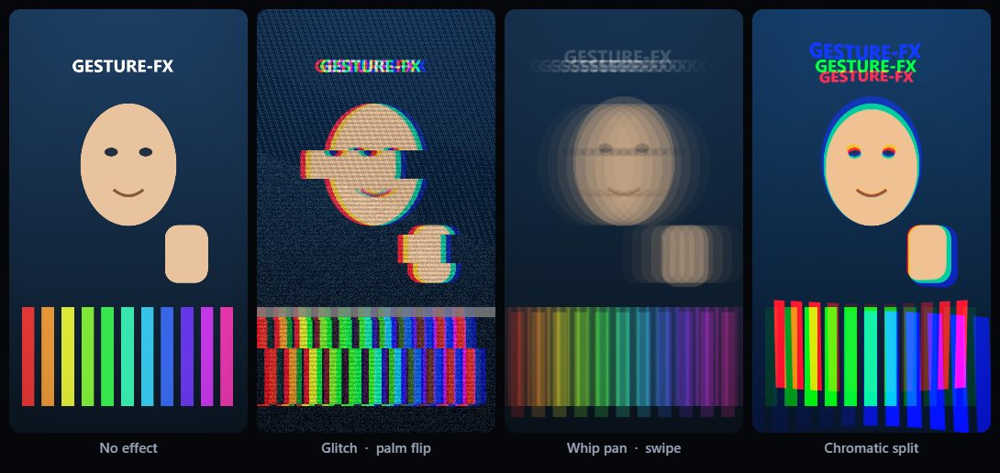
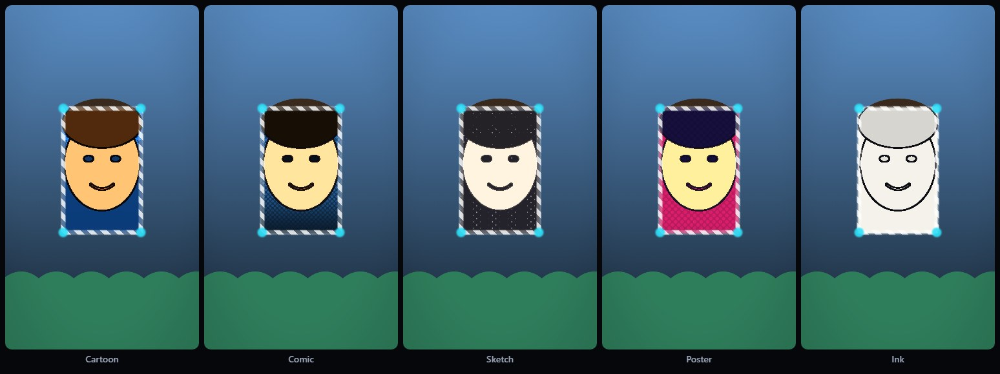
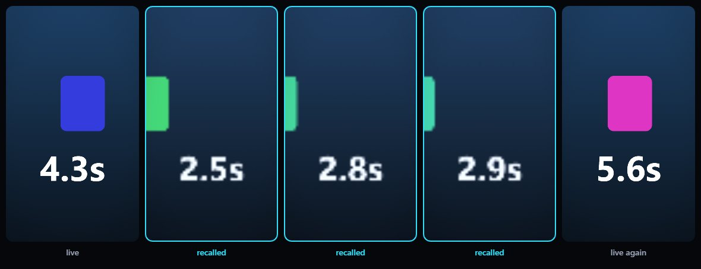

<style>
/* Make images transparent on light backgrounds */
.post-content img {
    mix-blend-mode: multiply;
}

/* Dark mode: Show original images with transparent backgrounds */
[data-theme="dark"] .post-content img {
    filter: none;
    mix-blend-mode: normal;
    border-radius: 8px;
    opacity: 0.95; /* Slightly reduce glare while maintaining contrast */
}

.equation {
    text-align: center;
    margin: 1.4rem 0;
    font-size: 1.05rem;
}

.equation-note {
    text-align: center;
    font-size: 0.85rem;
    color: #6c6c6c;
    margin-top: -0.9rem;
    margin-bottom: 1.4rem;
}

[data-theme="dark"] .equation-note {
    color: #9b9c9d;
}

/* General hover effect for all links in post content */
.post-content a {
    transition: all 0.3s ease;
}
.post-content a:hover {
    color: #767676;
    text-shadow: 0px 0px 0.5px #767676;
}

/* Dark mode hover effect (same color) */
[data-theme="dark"] .post-content a:hover {
    color: #767676;
    text-shadow: 0px 0px 0.5px #767676;
}
</style>


<small><em>The two-hand interaction. Four fingertips are the corners of a window, and the interior is the same scene rendered in a different medium. The window follows the hands.</em></small>

## Introduction

There are two quite different things one can want from a gesture recogniser, and
they are usually not distinguished.

The first is **control**. A gesture means a command, the command is executed, and
the user is satisfied if it happens soon. A few frames of latency is invisible.
Almost all of the literature addresses this case, and classification is the right
tool for it: assign a label to a frame or a window of frames, act on the label
[[1]](#ref-1) [[2]](#ref-2).

The second is **synchronisation**. The gesture is not a command but an event in
the recording, and something has to be aligned to the frame on which it
physically occurred. A cut, a transition, a sound. Here a few frames of latency
is the whole problem, because the output visibly lags its cause. Classification
answers a question of the wrong shape: it returns an interval over which a label
held, and what is wanted is an instant.

This work takes the synchronisation problem for one specific and common movement,
the rotation of an open hand about its own long axis, and shows that it admits an
exact solution. No classifier, no training data, no calibration, and one cross
product per hand per frame.

## The problem, stated geometrically

Take three landmarks on the hand: the wrist and the two outer knuckles, the index
and the little finger. These define two edges of the palm. The camera has already
projected them onto the image plane, so what is available is their projection, not
their true three-dimensional configuration.

Let <i>s</i> be the normalised two-dimensional cross product of those two projected
edges. It is the signed area of the parallelogram they span, divided by the
product of their lengths, so it is a pure number that does not depend on how large
the hand appears.


<small><em>The construction. Two palm edges from three landmarks, and the normalised signed area they span. Its zero is the instant the palm is edge-on to the camera.</em></small>

## The crossing theorem

The result the rest of the method rests on is that <i>s</i> factorises:

<p class="equation"><i>s</i>(<i>θ</i>) = <i>k</i>(<i>θ</i>) cos <i>θ</i></p>

<p class="equation-note">with |<i>k</i>(<i>θ</i>)| &gt; 0 for every <i>θ</i>, which is what makes the factorisation useful</p>

Two consequences follow immediately, and neither is an approximation.

**<i>s</i> vanishes if and only if the palm is edge-on.** Because <i>k</i> never vanishes,
the zeros of <i>s</i> are exactly the zeros of cos <i>θ</i>. The scalar is zero at the
precise orientation where the palm presents its edge to the camera, and nowhere
else.

**The sign of <i>s</i> tracks which face is presented.** Either side of that zero, the
sign is determined, so a change of sign is a flip and nothing else is.

Detecting the gesture therefore reduces to locating a zero crossing of a single
scalar quantity. That is a different kind of object from a classifier's output. A
classifier tells you that a label held over some frames. A zero crossing tells you
*when*, and it can tell you so more finely than the rate at which you sampled,
because a continuous quantity passing through zero can be interpolated between the
two samples that bracket it.


<small><em>The method in one card. Three landmarks, one scalar, and the crossing that dates the gesture.</em></small>

## Invariance, and where it comes from

Three invariances matter in practice, and all three are properties of the
algebraic form rather than of whatever estimator supplies the landmarks.

**Mirroring.** A mirrored image negates <i>s</i>. It does not move its zeros. A
front-facing camera that mirrors its preview therefore needs no special case.

**Scale.** The normalisation divides out both edge lengths, so the distance of the
hand from the camera is irrelevant.

**Handedness.** A left hand and a right hand differ in the sign of <i>s</i>, not in
where it vanishes.

This is worth stating carefully because it is the reason the method needs no
calibration. The invariances are not empirical observations that happened to hold
across a test set. They follow from the expression, so they hold for any hand, any
camera and any landmark estimator that returns the three points.

## Recovering the instant between samples

Landmark inference is expensive and is therefore run well below the display rate.
The crossing almost never falls on a sample.

Because <i>s</i> is continuous and its crossing is transverse, the instant can be
recovered by interpolating between the two samples that bracket the sign change.
This is where treating the gesture as the zero of a continuous quantity pays,
rather than as a label attached to a frame.

At a sampling interval of 41.7 ms, reporting the crossing at the bracketing
sample gives a mean absolute error of 23.0 ms, which is about what one would
expect from rounding to the nearest sample. Interpolating brings it to 6.7 ms,
a sixth of the interval at which the hand is observed.

| Localisation error | At the bracketing sample | Interpolated |
| :--- | ---: | ---: |
| Mean absolute error | 23.0 ms (0.55 frames) | **6.7 ms (0.16 frames)** |
| Median absolute error | 22.2 ms (0.53 frames) | 4.0 ms (0.10 frames) |
| Ninetieth percentile | 41.7 ms (1.00 frames) | 18.1 ms (0.43 frames) |
| Worst case | 66.3 ms (1.59 frames) | 26.7 ms (0.64 frames) |
| Mean signed error | −22.1 ms | +0.8 ms |

<small><em>Localisation error over the 114 detected flips. The mean signed error is the line to read: reporting at the bracketing sample is systematically late by most of a frame, and interpolation removes the bias rather than merely reducing the spread.</em></small>

Reporting an event more finely than one samples it is the practical consequence of
the whole approach, and it is not available to a classifier operating on the same
stream.

## The two-hand window

A second interaction uses four fingertips as the corners of a window onto a
restyled version of the same scene.

This needs a coverage predicate: given the four corners, which pixels are inside?
The obvious approach is to triangulate the quadrilateral and fill the triangles.
That is unsound, and it fails exactly when the interaction is most natural.

The moment the hands cross, the boundary self-intersects. The correct answer for a
self-intersecting quadrilateral is the even-odd rule, which renders two lobes and
leaves the pinch points between them uncovered. The triangle fan fills both lobes
*and* the region between them: for the symmetric crossing configuration it draws
half as much area again as the window actually encloses, a third of it outside the
boundary altogether.

The even-odd test is both correct there and cheaper. It is one of the few places
where the right answer costs less than the wrong one.



<small><em>The effects, composited onto the recorded surface rather than the camera stream, so no editing stage is required.</em></small>

## Stylising the interior

Three operators fill the window, and each has one parameter that cannot be chosen
by eye.

**An iterated edge-preserving filter**, in the lineage of bilateral filtering
[[3]](#ref-3). Its range width must vary across iterations, and the paper
quantifies why a fixed width is wrong.

**A quantiser**, whose amplification of residual noise is bounded rather than
assumed.

**A difference of Gaussians**, whose noise response is computed in closed form and
used to fix its one free mixing parameter.

The test of whether that analysis was right is measurable. A flat field was given
independent per-channel grain of ±15 of 255, a standard deviation of 8.7, and
delivered through the same capture path a camera uses. The mean absolute
difference between horizontally adjacent output samples, measured well inside the
window, was **4.5 of 255 without the window and 0.2 with it**. The grain comes
from a seeded stream, so both figures are reproducible rather than merely
reported.



<small><em>The seven media. The claim that they are distinguishable is measured rather than asserted.</em></small>

Seven media are offered, and they are meant to be nameable from a still. Rather
than assert that, all twenty-one pairs were measured by mean absolute channel
difference over the window interior. The widest, neon against ink, differed by
122.7 of 255. The closest, cartoon against paint, by 7.6, against a floor of
6 fixed before the measurement.

That closest pair is named deliberately. Cartoon and paint share a flattened
surface and differ mainly in saturation and stroke direction, so they are the pair
a reader should expect to find closest, and 7.6 is a thinner margin than the
rest of the set enjoys. "They look different" is otherwise an assertion by an
author about their own work.

## Implementation

Both interactions are embedded in a browser system built on MediaPipe hand
landmarks [[4]](#ref-4) [[5]](#ref-5), WebGL 2 [[6]](#ref-6), and the media
capture and recording specifications [[7]](#ref-7) [[8]](#ref-8). Landmark input
is smoothed with the One Euro filter [[9]](#ref-9), which is designed for exactly
this trade between jitter and lag in interactive input.

Two design decisions carry the system.

**Inference is rate-decoupled from presentation.** Landmark inference is rate
limited well below the display rate, and each recognised gesture carries the
timestamp of its cause rather than the timestamp of the frame on which it was
noticed. Presentation quality is therefore independent of inference throughput.

At 60 Hz the frame budget is 16.7 ms. Landmark inference measured 6 to 11 ms per
evaluation on desktop integrated graphics, texture upload 1 to 2 ms, and an effect
shader 0.5 to 2 ms. Inference dominates, which is what makes the decoupling
necessary. Feature extraction and detector evaluation for two hands and five
detectors measured below **0.1 ms combined**, which is consistent with the
criterion costing one cross product per hand.

**Effects composite onto the recorded surface, not the camera stream.** There is
no editing stage. What is recorded is what was seen.

In its default configuration the system runs entirely on the client: no server, no
key, no per-use cost [[10]](#ref-10). Two optional paths depart from this. They are disabled until
the user enables them, and the paper accounts for them rather than passing over
them quietly.


<small><em>The single-hand gesture driving an effect. The effect is composited onto the recorded surface as the take is made, so there is no editing stage afterwards.</em></small>



<small><em>The temporal buffer, verified with a subject that states its own draw time. With a requested delay of 2.2 s the strip runs from a live frame at 4.3 s, through recalled frames reading 2.5, 2.8 and 2.9 s, to a live frame at 5.6 s.</em></small>

## Evaluation

The criterion was tested against 60 generated sequences per class at a landmark
rate of 24 Hz with the shipped thresholds.

| Class | Requirement | Fired |
| :--- | :--- | ---: |
| Palm flip, quick, 180 to 520 ms | must fire | 54 / 60 (90.0%) |
| Palm flip, deliberate, 0.9 to 1.6 s | must fire | 60 / 60 (100.0%) |
| Held edge-on, 0.8 to 1.4 s | must not fire | 0 / 60 |
| Wobble to 54 to 79 degrees | must not fire | 0 / 60 |
| Rotating closed hand | must not fire | 0 / 60 |
| Entering frame mid-rotation | must not fire | 0 / 60 |
| **Total** | | **95.0% detected, 0 false positives in 240 near misses** |

<small><em>The two flip classes differ only in how quickly the hand is turned. The
quick class is the harder one, and it is where all six misses fall.</em></small>

The four near-miss classes are the part of the evaluation that carries the
weight, and each shares part of a flip's signature without being a flip: a palm
held edge-on, a wobble that stops short of turning over, a closed hand rotating,
and a hand that enters the frame already mid-rotation. A detector that fires on
everything scores perfectly on the flip classes alone, so the near misses are
what make the positive result mean anything.

**Behavioural coverage.** Four suites totalling 164 assertions run against the
shipped modules, covering the render passes, the coverage predicate under
crossing, the framing clamp, the noise reduction, the tracker's hysteresis and
dropout behaviour, and the rest.

One of those suites decodes the encoded output rather than trusting the
container's declaration of what it holds, and that distinction earned its cost. It
caught a defect no weaker check could see. The container was selected once at
startup, before it was known whether a take would carry sound, and the preferred
string named a video codec alone. A recorder given an explicit codec list encodes
those codecs and no others, so an attached audio track was accepted and then
silently discarded. The track was present in the stream, the file was well formed,
its declared type named the container correctly, and every recording was mute.
Only decoding the output distinguishes that state from a working one.

The correction is to choose the container per take, once the track set is known,
rather than once at startup.

## What remains unverified

The paper states this plainly rather than leaving it to be inferred.

The evaluation corpus has exact ground truth because it is generated, which is
what makes localisation error measurable to a fraction of a frame at all. It is
not a study of hands in the wild. The 95% and the 6.7 ms are properties of the
criterion under that corpus, and the near-miss classes are the author's own
construction of what a hard negative looks like.

The invariance results are proved rather than measured, so they do not depend on
the corpus. The timing figures are from one machine's integrated graphics.

## Conclusion

Posing a gesture as the zero of a continuous quantity rather than as a label
attached to a frame changes what the answer can be. A classifier returns an
interval over which a label held. A zero crossing returns an instant, and can
return it more precisely than the rate at which the hand was observed.

That is not a general result about gesture recognition. It is a specific result
about one movement whose projected geometry happens to factorise, and the value of
the paper is in showing that the factorisation is exact and that its consequences,
including all three invariances, follow from the algebra rather than from the
estimator or the data.

## Preprint, code, and demonstration

<div class="reference-container">

<div class="reference-item">
    <span class="reference-num">Paper</span>
    <span class="reference-text"><a href="https://github.com/Amey-Thakur/GESTURE-FX/blob/main/paper/main.pdf">Frame-Synchronous Hand Gesture Detection by Projected Winding Order (PDF)</a></span>
</div>

<div class="reference-item">
    <span class="reference-num">Code</span>
    <span class="reference-text"><a href="https://github.com/Amey-Thakur/GESTURE-FX">github.com/Amey-Thakur/GESTURE-FX</a>, MIT licensed</span>
</div>

<div class="reference-item">
    <span class="reference-num">Demo</span>
    <span class="reference-text"><a href="https://amey-thakur.github.io/GESTURE-FX/">amey-thakur.github.io/GESTURE-FX</a>, runs on the client with no server and no key</span>
</div>

</div>

## Citation

**Please cite this work as:**

<pre style="white-space: pre-wrap;"><code>Thakur, Amey. "Frame-Synchronous Hand Gesture Detection by Projected Winding Order" (Aug 2026). https://github.com/Amey-Thakur/GESTURE-FX.</code></pre>

**Or use the BibTex citation:**

```
@article{thakur2026winding,
  title   = "Frame-Synchronous Hand Gesture Detection by Projected Winding Order",
  author  = "Thakur, Amey",
  year    = "2026",
  month   = "Aug",
  url     = "https://github.com/Amey-Thakur/GESTURE-FX"
}
```

---

## References

<style>
.reference-container {
    padding-left: 0;
}
.reference-item {
    display: flex;
    margin-bottom: 0.8rem;
}
.reference-num {
    flex: 0 0 45px; /* Fixed width for the number column */
    font-weight: bold;
    color: inherit;
}
.reference-text {
    flex: 1; /* Takes remaining space */
}
</style>

<div class="reference-container">

<div class="reference-item">
    <span class="reference-num">[1]</span>
    <span class="reference-text"><a id="ref-1"></a><b>O. K&ouml;p&uuml;kl&uuml;, A. Gunduz, N. Kose, and G. Rigoll</b>, "Real-time Hand Gesture Detection and Classification Using Convolutional Neural Networks," <i>arXiv preprint arXiv:1901.10323</i>, 2019, <a href="https://doi.org/10.48550/arXiv.1901.10323">https://doi.org/10.48550/arXiv.1901.10323</a> [Accessed: Aug. 31, 2026].</span>
</div>

<div class="reference-item">
    <span class="reference-num">[2]</span>
    <span class="reference-text"><a id="ref-2"></a><b>Z. Shou, D. Wang, and S.-F. Chang</b>, "Temporal Action Localization in Untrimmed Videos via Multi-stage CNNs," in <i>Proceedings of the IEEE Conference on Computer Vision and Pattern Recognition (CVPR)</i>, 2016, <a href="https://doi.org/10.1109/CVPR.2016.119">https://doi.org/10.1109/CVPR.2016.119</a> [Accessed: Aug. 31, 2026].</span>
</div>

<div class="reference-item">
    <span class="reference-num">[3]</span>
    <span class="reference-text"><a id="ref-3"></a><b>C. Tomasi and R. Manduchi</b>, "Bilateral Filtering for Gray and Color Images," in <i>Proceedings of the Sixth International Conference on Computer Vision (ICCV)</i>, pp. 839&ndash;846, 1998, <a href="https://doi.org/10.1109/ICCV.1998.710815">https://doi.org/10.1109/ICCV.1998.710815</a> [Accessed: Aug. 31, 2026].</span>
</div>

<div class="reference-item">
    <span class="reference-num">[4]</span>
    <span class="reference-text"><a id="ref-4"></a><b>F. Zhang, V. Bazarevsky, A. Vakunov, A. Tkachenka, G. Sung, C.-L. Chang, and M. Grundmann</b>, "MediaPipe Hands: On-device Real-time Hand Tracking," <i>arXiv preprint arXiv:2006.10214</i>, 2020, <a href="https://doi.org/10.48550/arXiv.2006.10214">https://doi.org/10.48550/arXiv.2006.10214</a> [Accessed: Aug. 31, 2026].</span>
</div>

<div class="reference-item">
    <span class="reference-num">[5]</span>
    <span class="reference-text"><a id="ref-5"></a><b>C. Lugaresi et al.</b>, "MediaPipe: A Framework for Building Perception Pipelines," <i>arXiv preprint arXiv:1906.08172</i>, 2019, <a href="https://doi.org/10.48550/arXiv.1906.08172">https://doi.org/10.48550/arXiv.1906.08172</a> [Accessed: Aug. 31, 2026].</span>
</div>

<div class="reference-item">
    <span class="reference-num">[6]</span>
    <span class="reference-text"><a id="ref-6"></a><b>The Khronos Group</b>, "WebGL 2.0 Specification," <i>The Khronos Group</i>, 2022, <a href="https://registry.khronos.org/webgl/specs/latest/2.0/">https://registry.khronos.org/webgl/specs/latest/2.0/</a> [Accessed: Aug. 31, 2026].</span>
</div>

<div class="reference-item">
    <span class="reference-num">[7]</span>
    <span class="reference-text"><a id="ref-7"></a><b>World Wide Web Consortium</b>, "Media Capture and Streams," <i>W3C Recommendation</i>, 2025, <a href="https://www.w3.org/TR/mediacapture-streams/">https://www.w3.org/TR/mediacapture-streams/</a> [Accessed: Aug. 31, 2026].</span>
</div>

<div class="reference-item">
    <span class="reference-num">[8]</span>
    <span class="reference-text"><a id="ref-8"></a><b>World Wide Web Consortium</b>, "MediaStream Recording," <i>W3C Working Draft</i>, 2025, <a href="https://www.w3.org/TR/mediastream-recording/">https://www.w3.org/TR/mediastream-recording/</a> [Accessed: Aug. 31, 2026].</span>
</div>

<div class="reference-item">
    <span class="reference-num">[9]</span>
    <span class="reference-text"><a id="ref-9"></a><b>G. Casiez, N. Roussel, and D. Vogel</b>, "1&euro; Filter: A Simple Speed-based Low-pass Filter for Noisy Input in Interactive Systems," in <i>Proceedings of the SIGCHI Conference on Human Factors in Computing Systems (CHI '12)</i>, pp. 2527&ndash;2530, ACM, 2012, <a href="https://doi.org/10.1145/2207676.2208639">https://doi.org/10.1145/2207676.2208639</a> [Accessed: Aug. 31, 2026].</span>
</div>

<div class="reference-item">
    <span class="reference-num">[10]</span>
    <span class="reference-text"><a id="ref-10"></a><b>A. Thakur</b>, "GESTURE-FX: Gesture-Triggered Camera Effects in the Browser," Software, MIT License, 2026, <a href="https://github.com/Amey-Thakur/GESTURE-FX">https://github.com/Amey-Thakur/GESTURE-FX</a> [Accessed: Aug. 31, 2026].</span>
</div>

</div>
