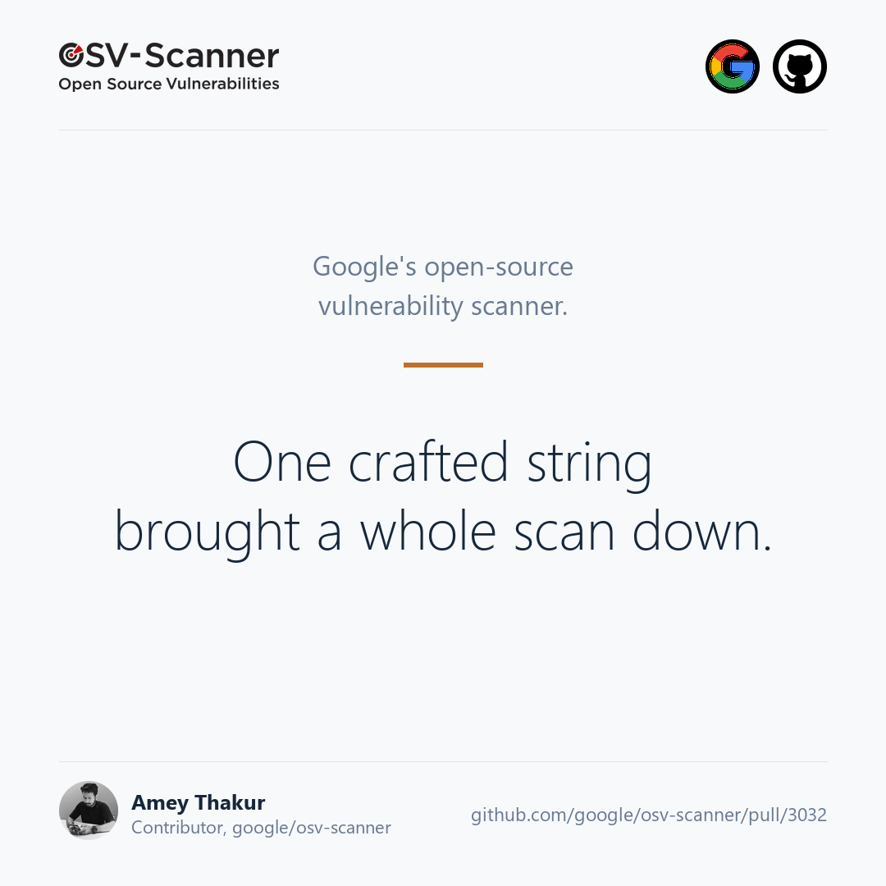

## In one paragraph

Most software is assembled rather than written. A modern application pulls in
hundreds of packages that somebody else maintains, and a scanner checks that
list against databases of known vulnerabilities. Google maintains one of the
most widely used of these, [OSV-Scanner](https://github.com/google/osv-scanner).
I found a way to stop it dead using a single string of text, reported it, wrote
the fix, and Google merged it on 2 September 2026.



## The part that matters if you do not write Go

Before OSV-Scanner can tell you anything about a package, it reads that
package's own description of itself. That includes the licence: MIT, Apache-2.0,
and so on.

That description is written by whoever published the package. It is not written
by you, and it is not written by Google. In security terms it is **untrusted
input**, which is a phrase worth unpacking: it does not mean the data is
probably malicious, it means nothing prevents it from being. Any code that reads
it has to survive the worst string somebody could put there.

Licences can be combined, so the format allows brackets for grouping, in the
same way arithmetic does:

```text
(MIT OR Apache-2.0) AND (BSD-3-Clause OR GPL-2.0)
```

To read that, the parser opens a bracket, works out what is inside, then comes
back out. Reading something by stepping into it and coming back out is called
**recursion**, and it is completely ordinary.

The problem is what happens when you never come back out. Every step inward
consumes a little of a fixed budget of memory called the stack. Nothing in the
parser counted the steps, and nothing in the file format limits how many
brackets a licence string may contain. So a string that is nothing but three
megabytes of open brackets walks the parser inward until that budget is gone.

In many languages, running out of stack raises an error the program can catch
and recover from. In Go it does not. It is a **fatal error**: the runtime prints
`fatal error: stack overflow` and kills the process outright.

That distinction is the whole vulnerability. A scanner that crashes on one bad
package does not skip it and continue with the rest. It ends the entire run. If
your deployment pipeline requires a clean scan before shipping, a single crafted
dependency anywhere in your tree stops the pipeline, and the failure looks like
a broken tool rather than an attack.

The formal name for this class is
[CWE-674, uncontrolled recursion](https://cwe.mitre.org/data/definitions/674.html).

## The code

Here is the mechanism, from `internal/spdx/satisfies.go`. The parser is a
recursive descent: `parseOr` calls `parseAnd`, which calls `parseExpression`,
and `parseExpression` calls back into `parseOr` whenever it meets an opening
bracket.

```go
if next == "(" {
    expr, err := parseOr(tokens)
    if err != nil {
        return nil, err
    }

    if tokens.peek() != ")" {
        return nil, errors.New("missing closing bracket")
    }
    ...
}
```

That is the entire loop. Read it as a cycle: every `(` in the input adds one
more frame to the stack, and there is no counter anywhere in the cycle. The
input decides the depth.

Reproducing it takes one line:

```go
strings.Repeat("(", 2_000_000) + "MIT" + strings.Repeat(")", 2_000_000)
```

## The fix

Forty lines across two files, and none of them are clever. That is the point:
the bug was not subtle, it was simply unstated.

First, a ceiling, written down with the reasoning next to it rather than as a
bare number:

```go
// maxDepth bounds how deeply nested the parser will recurse into bracketed
// sub-expressions. License expressions are supplied by scanned package
// metadata, which is untrusted; without a limit a deeply nested expression
// (e.g. many "(") recurses until the goroutine stack overflows, which is a
// fatal error that recover cannot catch. Real SPDX expressions nest only a
// handful of levels, so this ceiling is far above any legitimate input.
const maxDepth = 1000
```

Then a counter on the token stream itself, so the depth travels with the parse
rather than being threaded through every function signature:

```go
type tokens struct {
	tokens []string
	depth  int
}
```

And the check, at the one place the parser descends:

```go
if next == "(" {
    tokens.depth++
    if tokens.depth > maxDepth {
        return nil, fmt.Errorf("license expression nested too deeply (limit %d)", maxDepth)
    }

    expr, err := parseOr(tokens)
    if err != nil {
        return nil, err
    }
    tokens.depth--
    ...
}
```

Two details in that small block are worth naming.

**The decrement matters as much as the increment.** Without `tokens.depth--` on
the way out, a long run of sequential, non-nested brackets like `(MIT) (MIT)
(MIT)` would accumulate depth it never actually used, and a legitimate
expression would eventually be rejected. Depth is about how deep you currently
are, not how many brackets you have seen.

**The failure is ordinary.** It returns a normal parse error, the same kind the
parser already returns for a missing closing bracket. Nothing special-cases it,
nothing logs a warning about attacks, and the scan moves on to the next package.
A security fix that introduces a new failure mode has traded one problem for
another.

The ceiling of one thousand is deliberately generous. The most complicated
licence expressions in real circulation nest a handful of levels. Nothing
legitimate comes close, so no valid input is rejected to buy this.

## The test

A fix for a crash is only worth what its regression test is worth, and this one
has an unusual property: **without the fix, it does not fail, it terminates the
test binary.**

```go
func TestSatisfies_DeeplyNested(t *testing.T) {
	t.Parallel()

	// A license expression is untrusted input taken from scanned package
	// metadata. Deeply nested brackets must be rejected with an error rather
	// than recursing until the goroutine stack overflows, which is a fatal
	// error that recover cannot catch.
	license := models.License(strings.Repeat("(", 2_000_000) + "MIT" + strings.Repeat(")", 2_000_000))

	got, err := spdx.Satisfies(license, []string{"MIT"})

	if got {
		t.Errorf("Satisfies(deeply nested) = %v, want %v", got, false)
	}

	if err == nil {
		t.Fatal("Satisfies(deeply nested) = nil error, want a nesting-limit error")
	}

	if !strings.Contains(err.Error(), "nested too deeply") {
		t.Errorf("Satisfies(deeply nested) = %v, want a nesting-limit error", err)
	}
}
```

Two million levels, which is two thousand times the ceiling, so there is no
argument about whether the limit is doing the work. With the fix it passes in
under half a second, because the parser stops at level one thousand and never
allocates the remaining 1,999,000.

The boundaries were checked separately: shallow nesting parses, nesting exactly
at the ceiling parses, one level past fails cleanly, and sequential non-nested
brackets do not accumulate depth.

## Contributing it upstream

This is the part people ask about most, so it is worth writing down plainly.

**I filed an issue before writing any code.**
[Issue #2993](https://github.com/google/osv-scanner/issues/2993), with a
reproduction. For anything with a security shape this order matters: it lets the
maintainers decide whether the finding needs a private advisory before any of it
becomes public. Opening a pull request first would have published the
reproduction and taken that choice away from them.

**They judged it and assigned it back.** The maintainers looked at it, concluded
it was ordinary hardening rather than an embargoed vulnerability, and assigned
the implementation to me. That is a good outcome: the fix was wanted before it
was written.

**The Google CLA.** A [contributor licence agreement](https://cla.developers.google.com/)
is required for any contribution to a Google-maintained repository. It is a
one-time signature and takes a couple of minutes.

**Review and merge.**
[Pull request #3032](https://github.com/google/osv-scanner/pull/3032) went
through review and merged into `main` on 2 September 2026, and the issue closed
as completed the same minute.

**Where it stands today.** The fix is on `main` but not yet in a tagged release.
The newest release as I write is v2.5.1 from 17 August 2026, which predates the
merge. If you need it now, build from `main`; otherwise it arrives with the next
release.

## What I took from it

The bug was not hiding in anything clever. There was no subtle concurrency
problem, no exotic use of the type system, no cryptography. It sat at the
boundary where somebody else's data becomes your control flow, which is where a
great many of them sit.

Recursive descent is the normal way to write a small parser and it is a good
default. Its failure mode is simply that the **input decides how deep you go**.
Any code that walks user-supplied structure is making a promise about depth that
it has usually not written down: nested JSON, a linked object graph, a path
expression, a template that can include another template. Writing the promise
down costs a counter and a constant.

The second lesson is procedural, and it saved more time than the code did.
Reporting first and implementing second cost a few days of waiting and made the
entire exchange straightforward. The maintainers knew what was coming, had
already agreed it was worth fixing, and reviewed a change they had asked for.

---

The full record, including this animation in three formats, is in
[the discussion on my fork](https://github.com/Amey-Thakur/osv-scanner/discussions/1).
